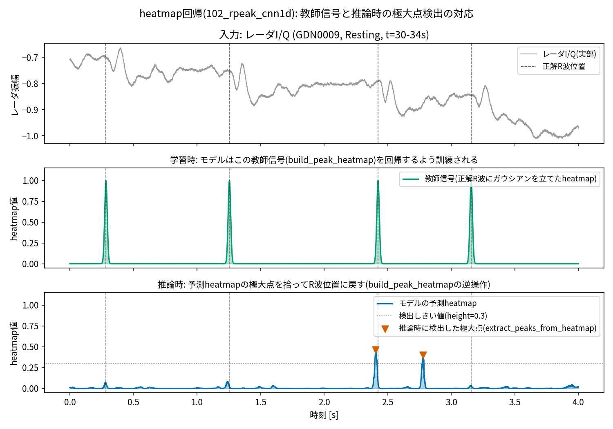

# 進捗報告 2026-08-05

> 本ファイルは発表用の整理版．日々の試行錯誤の全記録は `progress_report_3036-08-05.md`（ファイル名の年は誤記）に残してある．
> 構成: Part I ミーティング記録（既報のまま）／ Part II 研究の方向についての考察 ／ Part III 技術進捗（本文A4約3ページ）／ 付録

---

# Part I. ミーティング記録

## 2026-07-08 野田先輩ミーティング

- 「測れる」だけならセンサ候補は多いが，犬にジェルなしで正確に測れるものは少ない
- マルチモーダル心拍推定というアプローチ
  - 正解ラベルとなる心電図はジェル電極で取得する前提
  - 比較対象となる別アプローチ: 加速度，心音計，光電脈波(PPG)など
    - 加速度: スンウさんが持っている心弾動図(BCG)系データセットが参考になりそう
  - 電極方式の選択肢: ドライ電極(毛をかき分けるシリコン/とげ電極) vs 樹脂電極
  - ミリ波レーダ: 旭化成，上田さん，田中先生と関連
    - 原理は電波の反射(距離計測)．対象が静止していないと精度が出ない
- 「犬でPPG/ECGは既にやられている」という声もあるが，完全に解決済みとは考えにくく，残課題があるはず
- 計測条件を制約すると精度が出やすい
  - 特に運動時が一番の難関
  - 心電図誘導の配置(左右斜め，お腹と胸)
  - 人間同様，最終的に必要なのは波形そのものではなくHRV
- ミリ波関連
  - 旭化成のミリ波は信号処理主体
  - ヒト向けミリ波は先行研究が多く，犬向けも一定数存在
- 田中先生の構想: 犬のためのIoTハウス
- ポールさん: 実験環境下で犬の感情を断定し分類モデルを構築
- 田中先生が最終的に求めているのは，犬の心拍や内部状態を推定できる家庭設置型IoTデバイス
  - 「機嫌が悪い/体調が悪い/遊んでほしい/危険な状態」を判定し飼い主に通知
  - 飼い主の声を流すなどのインタラクションも構想に含む

## 2026-07-21 スンウさんミーティング

- KAMEC(計測環境)では心電図・加速度・ジャイロを同時取得
- 田中先生・岩永先生はミリ波/連続波レーダが専門
- 提案: 呼吸数と心拍数を同時に予測するモデル
- 複素数によるアプローチ: フーリエ変換で振幅だけでなく位相も使う
  - 複素数のまま学習すれば情報量が増え，学習性能が上がるのではという仮説
- エッジ実行がホット
  - GNN/GAN
  - NCP
  - 超次元コンピューティング
- 応用先として健康モニタリング全般

## 野田先輩・スンウさんからのまとめ

- 野田先輩から
  - マルチモーダルなセンサから心電図を予測するアプローチ
  - 犬は毛深く運動も多いため計測が難しい
  - 野田先輩のDC・スプリング申請書: 「イヌの情動推定→ヒトやデバイスが介入」という構想はあるが，目的関数が未設定
- スンウさんから
  - ミリ波→ECG推定を推奨
  - エッジデバイスでの実行を想定し，パラメータ数を考慮すべき
- RR-interval推定 → Valence・Arousal推定のあと，どうするか？
- IoT の視点で思いつくイヌの健康モニタリング・介入のアイデア
  - 運動を誘発するデバイス(BLEモーションキャプチャ + 障害物・イヌ位置認識で転がって誘発)
  - 睡眠の質の推定・向上
  - 排泄物の量・水分量から体調分析
  - 体表温に応じたエアコン自動調整
  - カーテンで明るさ調整し昼寝の質を向上

---

# Part II. 考察: RR間隔の先に何を置くか（個人の見解）

「RR間隔 → Valence・Arousal 推定のあと，どうするか」という積み残しに対する，現時点での私の案を述べる．

## II-1. 構想

イヌのRR間隔から**Arousal**を，画像・音声から**Valence**を連続モニタリングする（以下併せて V-A。II-4で述べる通り，自律神経指標だけにValenceを背負わせないための二チャネル構成である）．これに**画像**と**音声**を同時記録する．音声からは人の話し声を Transcript として取り出し，音声と画像から「ヒトがイヌに対して行ったはたらきかけ（より一般には，イヌとヒトとのかかわり）」を VLM でテキスト化する．そのうえで，

- 介入の説明 `d = VLM(Transcript(音声), 画像)`
- 状態変化 `Δs = (ΔValence, ΔArousal)`

の対応 `d ↔ Δs` を学習する，というのが骨子である．

この対応づけ**だけ**でも，「どんなはたらきかけが，どんな状態変化を引き起こすか」という基盤的な知識が得られる．重要なのは順序で，**この基盤モデルができて初めて「この介入で犬の感情はどう変わるか」という予測に根拠が生まれる**．逆に言えば，これを飛ばして介入を設計すると，野田先輩の申請書で未設定のままになっている「目的関数」を，根拠なく人間が決め打ちすることになる．本構想は，その目的関数を**データから同定する**ための土台にあたる．

さらに，順方向 `d → Δs` だけでなく，観測された `Δs` を引き起こした介入（あるいはその背後にある目的関数）を復元する**逆推論**も定式化できる．

## II-2. 想定シナリオ

| # | 向き | シナリオ | 出力の形 |
|---|---|---|---|
| S1 | 順 | **効果予測**: 現在の文脈で候補となるはたらきかけを提示すると，予想される Δ(V,A) を返す | 「今この子に抱き上げは覚醒を上げる可能性が高い」 |
| S2 | 逆 | **介入推薦**: 望ましい Δ を指定すると，それを起こしうる介入をテキスト空間で検索する | 「落ち着かせたい → 低い声でゆっくり名前を呼ぶ」 |
| S3 | 逆 | **目的関数の同定（逆強化学習的）**: 飼い主の一連の行動列から，その人が暗黙に最適化していた目的を推定する．うまくいっている飼い主の方針を，他の飼い主へ転移できる | 「この飼い主は覚醒の急上昇を避ける方針を取っている」 |
| S4 | 順 | **説明生成**: V-A 系列の変化点を検出し，その直前区間の映像・音声を VLM に説明させる．「なぜ今この子はこうなったか」を事後に言語化する | 日次のふりかえりレポート |
| S5 | 反証 | **内因性異常の検出**: 介入で説明**できない**状態変化を残差として取り出す．外的なはたらきかけに帰属できない変化は，痛み・体調不良・環境要因の候補になる | 田中先生の構想「体調が悪い」通知に直結 |
| S6 | 順 | **個体差・文脈依存の同定**: 同じ介入でも個体・時間帯・先行文脈で符号が変わる箇所を洗い出す．イヌ側の「好み」を，行動的な顕示選好として同定できる | 個体適応・福祉評価 |
| S7 | 展開 | **ヒトへの移植**: 枠組み自体は種に依存しない．自己申告が困難な対象（乳児・重度介護・失語）に，そのまま同じ構成で適用できる | 種横断の一般性 |

S5 は特に有望だと考えている．S1〜S4 が「介入で説明できた分」を使うのに対し，S5 は**説明できなかった残差**を使う．同じモデルの表と裏であり，追加の学習を必要としない．

## II-3. この構想の強み

1. **ラベルが要らない**．V-A は生理から，介入の説明は VLM から自動生成されるため，人手アノテーションなしに日常記録からデータが貯まる．犬のラベル付きデータセット構築が最大のボトルネックである本テーマにおいて，これは決定的な利点になる．
2. **既存の資産がそのまま土台になる**．Part III のRR間隔推定精度の向上は，そのまま本構想の入力品質の向上として効く．
3. **単なる「感情分類 + LLM翻訳」ではない**．分類ではなく，介入テキストと状態変化ベクトルの**対応関係**そのものを学習対象に据えている点が，既存の LLM 応用製品との差分になる．

## II-4. 前提として注意すべき点（自分たちの過去の検証から）

構想を成立させるうえで，過去に実データで検証して崩れた前提を繰り返さないよう，先に書いておく．

- **自律神経指標から Valence（感情価）を読むのは原理的に難しい．** 公開データ（WESAD・CASE）で検証した結果，覚醒（Arousal）は生理から読める一方，感情価は覚醒を統制すると相関がほぼ消える．したがって V 軸を RR 間隔に背負わせてはいけない．**A 軸は生理（RR間隔）から，V 軸は表出（画像・音声）と文脈から取る二チャネル構成にする**．本構想が最初から画像・音声を併用しているのは，この意味で必然であり，むしろ構想の中核として明示すべき点である．
- **個体内正規化は必須**．生の HRV 指標では個体差が支配的になる（検出 AUC 0.589 → 個体内正規化で 0.94）．
- **RMSSD は標本化に弱い**．拍時刻ジッタ σ_t に対し `RMSSD_meas ≈ √(RMSSD_true² + 6σ_t²)` で必ず上振れする．下流の状態推定には HR を主指標に置くほうが頑健（HR単独のほうが RMSSD 併用より検出性能が高かった）．
- **「介入 → 状態変化」を因果として扱うには対照が要る**．体動・時刻・先行状態が強い交絡になる．**無介入の安静区間を必ずデータに含める**設計にしておく．
- 変化量 Δ の窓幅は，過去に「42秒で回復する」という所見が窓の重なりによる見かけの自己相関だった，という失敗をしている．**重複窓で自己相関を測らない**．

---


# Part III. 技術進捗

## III-1. 使用データセットと先行研究

使っているのは公開されているヒトのミリ波レーダ–心電図同時計測データセット **MMECG**．犬のデータを取る前段として，ヒトの公開データで手法を確立する段階にあたる．書誌情報の詳細は付録Dに，各論文の要約は付録Eにまとめた．

| | データセット原著 | 直接の出発点（コードベース） |
|---|---|---|
| 論文 | Chen et al., "Contactless Electrocardiogram Monitoring With Millimeter Wave Radar" | Zhang et al., **radarODE** / **radarODE-MTL** |
| 掲載 | IEEE T-MC 23(1):270–285, 2024 | IEEE T-MC 2025 / IEEE T-IM 2025 |
| 所属 | 中国科学技術大学（USTC）サイバー科学技術学院 | 西交利物浦大学（蘇州）ほか |
| 内容 | ビームフォーミング等の信号処理で心臓由来の微小運動を4次元抽出し，Transformer + TCN でECGへ変換 | 心電波形の常微分方程式をデコーダに埋め込む．MTL 版は 3 タスク（波形・拍間隔・R波位置）に分解 |
| 成績 | RR間隔誤差 中央値 **3 ms**（35被験者・200トライアル） | 検出漏れ率 0〜3.34%，波形相関 89.6%（11被験者・91トライアル） |

**比較の非対称性（重要）**: 公開されているのは部分データ（**11被験者・91トライアル・4.55時間**）だけで，原著の 35被験者・10時間ではない．さらに**信号処理側のコードは非公開**であり，学習側の入力に使う時間–周波数変換（SST）も切り出し方が非公開のため Python で近似再実装している．したがって**原著の 3 ms を我々の数値と直接比較することはできない**．以降の比較はすべて，入力・分割・評価コードを我々の側で統一したうえでの**モデル間の比較**である．

## III-2. タスクの定義と評価条件

**入力**: レーダの 50 点分の反射信号 RCG（200 Hz）．4 秒 = **800 サンプル**を 1 窓として `(50 チャネル, 800 サンプル)` を入れる．各点には 3 次元座標 `posXYZ` が付随する（録音中は不変）．

**出力（主タスク）**: 800 サンプル分の **heatmap**（各時刻に R 波がある確からしさ，[0,1]）．教師信号は参照ECGの R 波位置に σ = 10 ms のガウシアンを立てたもので，**回帰でも分類でもなく，物体検出でいうキーポイント検出と同じ定式化**．推論時は極大点を R 波位置とする．

**指標**: ① **F1** = 予測ピークと正解 R 波を ±50 ms 以内で対応づけたときの適合率（誤検出の少なさ）と再現率（見逃しの少なさ）の調和平均（単純な検出率ではなく，誤検出も見逃しも両方減点される指標），② **RR間隔 MAE** = 連続する R 波の間隔の誤差（HRV に直結する主指標），③ **RMSSD MAE** = 実際に使う HRV 指標そのものの誤差，④ **HRV算出可能率** = 44 トライアル中 HRV が計算できた割合（検出が疎すぎると HRV が定義できない）．

**推論の与え方**: 録音全体を 1 秒ステップのスライディング窓で走査し，重複区間の予測を平均で融合して 1 本の連続 heatmap にしてからピーク検出する．RMSSD 算出時は標準的な異常 RR 除去（生理的にありえない間隔と局所中央値から 20% 以上外れた間隔を除去）を通す．これを入れないと 1 拍の見逃しで RMSSD が桁違いになる．

**分割**: 学習 7 被験者 / 検証 1 / テスト 3（被験者単位）．

## III-3. 診断: 時間分解能のボトルネック

原著の学習側パイプラインは，ピーク検出の前に時間分解能を大きく落としている．

- SST（時間–周波数変換）で 800 サンプル → 120 フレーム（**6.7 倍**）
- バックボーン内の stride 付き畳み込みで 120 → 31 ステップ（**さらに 3.87 倍**）
- 合計 **約 25.8 倍**．1 サンプル = 5 ms だったものが，デコーダの入力時点で 1 ステップ ≒ 129 ms になっている

RR 間隔の誤差はピーク位置の誤差そのものなので，これが直接の律速になる．**そこで時間–周波数変換もダウンサンプリングも行わず，生の時系列のまま 200 Hz の分解能を出力まで保つ**設計に切り替えた．以下 2 モデルに共通する方針である．

## III-4. モデル1: 生信号 Anchor CNN（1次元 CNN，0.356 M パラメータ）

入力 `(50, 800)` → **膨張畳み込み（dilated Conv1d）6 層** → 1×1 畳み込みヘッド → sigmoid → 出力 `(800,)`．各層は BatchNorm1d + ReLU + Dropout(0.1) を伴い，チャネル数 64，カーネル長 15．損失は heatmap への BCE，Adam，lr = 5e-4．

膨張畳み込みはカーネルのタップ間隔を空けて畳み込む手法で，層ごとに間隔を 1, 2, 4, … と倍にすれば**プーリングを一切使わずに受容野だけを指数的に広げられる**（6 層で ±2.2 秒をカバー）．`padding="same"` により系列長は全層で 800 のままなので，**入力の 1 サンプル（5 ms）と出力の 1 サンプルが 1 対 1 に対応する**．

```python
for i in range(n_layers):                      # rpeak_dilated_cnn1d.py:41-49
    dilation = 2 ** i                          # ← 間隔を倍々に = 受容野が指数的に拡大
    layers += [nn.Conv1d(in_ch, channels, kernel_size, padding="same", dilation=dilation),
               nn.BatchNorm1d(channels), nn.ReLU(), nn.Dropout(dropout)]
```

**教師信号と推論時の動作の対応**（図: `reports/mmecg_comparison/heatmap_teacher_vs_inference.png`、
生成スクリプト: `scripts/plot_heatmap_teacher_vs_inference.py`）: 学習時は正解R波位置に
ガウシアン(`build_peak_heatmap`)を立てたheatmapを教師信号として密なBCE損失で学習する
（137行目の通り回帰でも分類でもなくキーポイント検出の定式化であり、BCEは連続値ではなく
各時刻の「R波中心らしさ」をソフトラベルとして扱う分類系の損失である）。推論時は
モデルが出力したheatmapの**極大点**(`extract_peaks_from_heatmap`、しきい値0.3以上かつ近傍で
最大)を拾ってR波位置に戻す。下図は102_rpeak_cnn1d(ヒトSchellenbergerデータ、test被験者
GDN0009)の実際の窓での例で、教師信号(中段)・予測(下段)とも4つのR波すべてが誤差6ms以内で
一致する窓を選んでいる。**この対応の仕組みを見せることが目的の図であり、モデルの平均的な
精度を代表する窓ではない**(平均的な検出性能はF1 0.32〜0.57、被験者間で変動。数値は本文の
表を参照)。



## III-5. モデル2: 空間 GNN（0.034 M パラメータ）

50 個の反射点は胸郭上のばらばらの位置から返ってきた信号だが，モデル1 はこれを単なる 50 チャネルとして扱っており，**どの点とどの点が空間的に近いかを使っていない**．原著も 3 次元位置埋め込み + Transformer で空間構造を扱っており，押さえるべき情報だと判断した．

構成は 4 段:
1. **点ごとの時間エンコーダ**: 50 点すべてに**重みを共有した** 1D CNN（stride 2 を 3 段）で各点を 32 次元の特徴系列にする
2. **位置の埋め込み**: 3 次元座標を線形層で 32 次元に写像して加算
3. **グラフ畳み込み**: 3 次元距離から **k 近傍グラフ（k = 6）**を作り，**GATConv（注意機構つきグラフ畳み込み）を 2 層**．全結合の自己注意と違い，**物理的に近い点どうしだけを結ぶ帰納バイアス**を入れている
4. **時間デコーダ**: 点方向に平均プーリングし，転置畳み込み 3 段で 800 サンプルに戻して sigmoid

点ごとに重みを共有しているため，50 点を処理しても重みは 1 点分しか持たない．これが 0.034 M という小ささの理由．

```python
dist = torch.cdist(pos.unsqueeze(0), pos.unsqueeze(0)).squeeze(0)  # spatial_graph.py:17-21
dist.fill_diagonal_(float("inf"))                                  # 自分自身を除外
_, nn_idx = torch.topk(dist, k, dim=1, largest=False)              # 近い k 点を選ぶ
return torch.stack([torch.cat([src, dst]), torch.cat([dst, src])]) # 無向グラフの辺リスト
```

## III-6. 精度の比較

入力・分割・評価コードを統一した比較．前処理は再現できていないため，原著の論文値ではなく**原著の実装を我々の環境で学習させた結果**と比べている．

| モデル | 入力 | パラメータ数 | F1 | RR間隔 MAE | RMSSD MAE | HRV算出可能率 |
|---|---|---|---|---|---|---|
| 原著EGA（3タスク同時学習） | SST（50×71×120） | 37.71 M | 0.164 | 34.64 ms | 31.97 ms | — |
| 原著 単一タスク | SST（50×71×120） | 26.83 M | 約 0.18 | 約 31 ms | — | — |
| **生信号 Anchor CNN 64ch** | 生信号（50×800） | **0.356 M** | **0.570** | 15.43 ms | 46.46 ms | 100% |
| **空間 GNN（posXYZ）** | 生信号 + 座標 | **0.034 M** | **0.733** | 11.76 ms | **18.26 ms** | 100% |

※ 原著EGA のみ SST 変換に 1 トライアル約 8 分かかるため，テスト被験者 1 名の 15 トライアルで測定（母数が異なる）．
※ 空間GNNの数値は2026-08-07時点の最新版（R波正解ラベルをNeuroKit2で再検出し，heatmapの
ラベル幅を再調整した上で本番学習した構成）に更新した．いずれもモデルの学習に使っていない
被験者（テスト用に分けた3名）のデータで評価している．

1. **時間分解能を保持した設計が効いている．** F1 は 3.5 倍以上，RR間隔 MAE は 1/3 未満．ただし前処理を再現できていない以上，これは原著手法全体への評価ではなく**同一条件に揃えたモデル間の差**である．
2. **空間情報を使うモデルが検出性能・タイミング精度の両方で上回る．** GNN は Anchor CNN に対しF1・RR間隔・RMSSDのいずれでも優位（ラベル再検出とheatmap設計の見直しにより，かつて見られた「検出性能とタイミング精度のトレードオフ」は解消した）。
3. **精度向上がパラメータ増加を伴っていない．** 最も精度が良いモデルが最も小さい．

**先行研究の論文値との関係（重要な注意）**: radarODE 系は我々と全く同じ 11 被験者・91 トライアルを使っているが，**RR 間隔誤差を報告しておらず**（指標は検出漏れ率と波形の RMSE・相関），直接は比べられない．**検出漏れ率とF1も単純比較できない点に注意**: 検出漏れ率は見逃し（再現率の裏返し）のみを表す指標で，誤検出（適合率）を反映しないのに対し，F1は両方を加味した指標である．彼らの検出漏れ率 0〜3.34%（＝再現率 96.66〜100% 相当）は非常に高い水準だが，適合率が非公開であるため，これだけから「我々のF1より優れている」とは言えない．また彼らは 11-fold の交差検証（毎回 10 被験者で学習）で，我々の 7 被験者学習より有利な設定．**我々が原著実装を再学習して得た F1 0.164 は論文値から大きく劣化しており，前処理を再現できていないことが主因**と見るのが自然で，「この数字が原著手法の実力」とは主張できない．RR 間隔で測っている研究としては USTC の後続研究（ICASSP 2024: 拍間隔誤差 中央値 12 ms・RMSSD 誤差 7.3 ms／Nature Communications 2024: 外来患者 6,222 名で 26.1 ms）があり，我々の 11.76 ms は桁としては同水準だが，データも集計方法も違うため優劣は主張できない（付録E）．

## III-6b. 発見: R波の教師ラベル自体がT波と混同されていた問題（対応中）

heatmapの出力を詳しく見ると，1心拍につき隣接する2つの凸（極大点）が生成されており，
**2つ目の凸の位置は元波形のT波のスパイク位置と一致していた**．さらに
`reports/mmecg_comparison_2026-08-05/continuous_stitched_reconstruction.png` の
波形生成結果を確認したところ，**正解R波として使っているラベル自体がT波の位置に
付いていた例**が見つかった（`ecgshape_step1_context4s.png` でも同症状，
`ecgshape_step1_examples.png` の相関下位3例はR-T区間や1周期分のR-T見逃しと
相関を取っていたため低相関は当然の結果だった）．波形回帰モデルもキーポイント
検出モデルも，**教師ラベルの生成に使っていた同じR波検出関数**
（z-scoreしきい値 + `scipy.signal.find_peaks`，QRS強調のバンドパスフィルタなし）
に起因する同一の問題を抱えていたことになる．

**応急対応**（`rpeaks.py::extract_peaks_paired_dedup`）: heatmapの検出しきい値を
下げたうえで，指定時間内に隣接する2つの極大点が出た場合は前者（R波側）のみを
採用する後処理を追加した．既存チェックポイントに対する効果はモデルごとに異なった：

| モデル | 変更前 | 変更後 |
|---|---|---|
| 生信号 Anchor CNN（しきい値0.10 + dedup） | F1 0.570 | **F1 0.639** |
| 空間 GNN（しきい値0.10 + dedup） | F1 0.497 | F1 0.228（悪化） |
| 空間 GNN（しきい値0.3 据え置き + dedupのみ） | F1 0.497 / RR-MAE 10.34 ms | **F1 0.513 / RR-MAE 10.27 ms** |

GNNはしきい値を下げすぎるとノイズを拾いすぎて悪化するため，**最適な応急対応のパラメータはモデルごとに異なる**（単一の推奨値では済まない）．

**恒久対応**（空間GNNで確定，生信号 Anchor CNNは進行中）: 外部で検証済みのR波検出
アルゴリズム NeuroKit2（Makowski et al., 2021）を正解ラベルの再生成に採用した．全91
トライアルに対してNeuroKit2で異常に短いRR間隔（生理的にありえない値）が0件だったのに
対し，旧来の検出器は曖昧な結果だった．空間GNNは正解を都度計算する実装のため先に着手し，
8epochプローブ（F1 0.510→0.549）で見込みを確認したうえで本番50epochの再学習を実施．
**新旧チェックポイントを同一のNeuroKit2正解に対して公平に評価**した結果：

| チェックポイント | F1 | RR-MAE | RMSSD-MAE |
|---|---|---|---|
| 旧（旧ラベルで学習） | 0.510 | 10.27 ms | 20.90 ms |
| 新（NeuroKit2ラベルで学習し直し） | **0.551** | 10.69 ms | **16.27 ms** |

RR-MAEはほぼ横ばいだが，RMSSD（HRVの主要指標）の誤差が明確に改善した．生信号
Anchor CNN側は全データのNeuroKit2再ラベル付け（キャッシュを使う実装のため時間を要する）
を実行中．完了後，同様の本番再学習と公平比較を行い，本節の表を確定させる．

**副次的な検討: 極大点の選び方（後処理）と損失設計（2026-08-06，ユーザ指摘）**:
後処理は生成済みheatmapの中から極大点を選ぶことしかできないため，モデルが真のR波位置
でheatmap値を十分上げられていない（見逃し）場合は取り返せない．この観点から2つの改良を
試した．

1. **リズム一貫性ベースのピーク選択**（`extract_peaks_rhythmic`）: 低しきい値で拾った
   候補極大点のうち，直前区間とほぼ一定の間隔で連なる系列だけを動的計画法で選ぶ後処理
   （音楽情報処理のビートトラッキング，Ellis, 2007と同型の定式化）．孤立したノイズ状の
   候補は規則的な系列を構成できないため自然に脱落する設計．旧ラベル学習済みチェックポ
   イントに適用した結果は**モデルごとに一長一短**だった：Anchor CNNはF1 0.51〜0.52
   （旧手法0.570・paired_dedup 0.639より悪化），GNNはF1 0.55前後（旧手法0.497・
   paired_dedup 0.513より改善）だがRR-MAEは13 ms前後（旧手法9.67 ms・paired_dedup
   10.27 msより悪化）．単一の後処理アルゴリズムがすべてのモデルで優位というわけでは
   ない．
2. **heatmap生成側の損失をrecall重視に変更**（`heatmap_focal_loss`，CornerNet/CenterNet
   由来のpenalty-reduced focal loss，Law & Deng 2018／Zhou et al. 2019）: BCEは適合率・
   再現率を対称に扱うため，見逃し防止側に非対称な重みを持つ損失に変えられないか試した．
   空間GNNで8epochプローブ（NeuroKit2ラベル，他は本番設定と同一）を実施したところ，
   既定しきい値0.3ではF1 0.285まで悪化（recallが多くのトライアルで0.01〜0.2に崩壊）．
   focal lossはheatmapの値分布自体を変えるためしきい値を0.10・0.02まで下げて再評価した
   が，F1は0.503止まり（BCE版の0.551に届かない）で，RMSSD-MAEはむしろ39 ms台まで悪化
   した．**8epochプローブの段階で明確に見込みが立たないため，この方向は見切った**（付録A
   に追記）．
3. **Pan-Tompkins型の適応的二重しきい値+searchback**（`extract_peaks_adaptive_searchback`，
   Pan & Tompkins, 1985）: 直近RR間隔の履歴から次拍の予想タイミングを持ち，大幅に遅れて
   未検出の場合だけしきい値を緩めて過去に遡る，ECGのQRS検出分野で標準的な方式．heatmap
   出力に適用してみたが，今回のデータではうまく機能しなかった（後述の比較参照）．

**同一heatmapでの4手法の公平比較**（`compare_peak_postprocessing.py`，NeuroKit2ラベルで
本番学習し直した空間GNN(config274)のheatmapを一度だけ計算・キャッシュし，同じ入力に
4つの後処理を適用）：

| 後処理 | F1 | RR-MAE |
|---|---|---|
| 旧手法（しきい値0.3） | 0.551 | **10.69 ms** |
| paired_dedup（応急対応，しきい値0.10） | 0.227（大幅悪化） | 13.93 ms |
| リズム一貫性ベース（DP） | 0.558 | 12.71 ms |
| Pan-Tompkins型 searchback（既定パラメータ） | 0.303（悪化） | 13.67 ms |
| Pan-Tompkins型 searchback（**再校正後**） | **0.687** | 12.00 ms |

**重要な発見1**: 応急対応のpaired_dedupは，NeuroKit2で正解ラベルを付け直した新モデルには
**むしろ有害**（F1 0.551→0.227）だった．paired_dedupはR波とT波の混同という「誤ラベルに
起因する症状」を抑えるための処置であり，恒久対応（正解ラベルの修正・再学習）でその根本
原因が解消された後は，単にしきい値を下げてノイズを拾いやすくするだけの副作用が残る．
**応急対応と恒久対応は同時に使うべきではない**（恒久対応が効いたモデルには応急対応を
適用しない）．

**重要な発見2（原因診断とパラメータ再校正）**: Pan-Tompkins型は既定パラメータで大幅に
悪化したため，適合率・再現率を個別に見たところ **precision=0.189 / recall=0.803**
（旧手法は precision=0.716 / recall=0.486）と，searchbackが過剰発火してノイズを大量に
拾っていることが分かった．heatmapの値分布を調べると，**真のR波位置での予測値は中央値
0.25程度（74.6%が0.3未満）しかなく，ノイズ床の平均0.14との分離が乏しい**（単一窓・
複数窓いずれで見ても同様で，窓の重ね合わせ融合による平滑化が原因ではなく，モデル自体が
教師のガウシアン中心=1.0まで自信を持てていないことを確認済み）．Pan-Tompkinsの忘却係数
やしきい値比（原著は0.25）は，QRS前処理後の高SN比信号を前提にした値であり，この
分離の乏しい入力にそのまま転用すると過剰発火する．しきい値比を`threshold_frac`として
パラメータ化し，キャッシュ済みheatmapに対するグリッドサーチ（`sweep_adaptive_searchback_params.py`，
GPU不要）で再校正した結果（candidate_height=0.20, threshold_frac=0.8,
searchback_threshold_frac=0.6），**F1が0.687まで改善し，これまでに試した全後処理の中で
最良**となった（precision=0.683, recall=0.705）．RR-MAEは旧手法の10.69msに次ぐ12.00ms．
「モデルの学習が原因ではなく後処理アルゴリズムの校正が原因だった」という，CLAUDE.md R5
（モデルより先に入力と評価を疑う）を後処理アルゴリズム自体にも適用した形の教訓である．

## III-6c. 前処理の横断比較と現行の生産用構成確定（2026-08-06/07、2026-08-07訂正済み）

> **訂正（2026-08-07）**: 本節は当初「Pan-Tompkins型後処理を再校正した構成（F1=0.687）の
> RR間隔誤差は10.69ms・RMSSD誤差は16.27ms」として記録していたが，これは異なる2つの
> 後処理方式の数値を取り違えたものだった。正しくはRR間隔誤差10.69ms・RMSSD誤差16.27msは
> 「heatmapの値がしきい値を超えた点をそのままR波と判定する単純な方式」（F1=0.551）の
> 数値であり，Pan-Tompkins型後処理（F1=0.687）の正しい数値はRR間隔誤差12.00ms・
> RMSSD誤差20.71msだった。この訂正を受けて全候補を横並びで再評価した結果，
> **現行の生産用構成はIII-6の表に反映した新しい空間GNN構成（R間隔誤差11.76ms・
> RMSSD誤差18.26ms・F1=0.733）に更新した**。以下の本文は当時の試行錯誤の記録として
> 残すが，末尾の結論部分は更新済みの内容に置き換えている。

後処理の改良と並行して，前処理（RCG正規化前の加工）側の改良も単一変数（CLAUDE.md R4）
で複数試した．いずれも8epochプローブでconfig274（前処理なし）と比較し，見込みが立った
ものだけ本番50epochへ進めた（CLAUDE.md R2）．

| 前処理 | 由来 | 8epochプローブ | 本番50epoch |
|---|---|---|---|
| バンドパス（[1,25]Hz Butterworth） | 既存実装の転用 | F1=0.343（明確に悪化） | 見送り |
| EMAクラッタ除去（適応的基線除去，FMCWレーダ分野） | 新規実装 | F1=0.529（274と同水準，中立） | 見送り |
| チャネル重み付け（心拍帯パワー比ベース，"Cardio-Focusing"型） | 新規実装 | F1=0.524，RR-MAE/RMSSD-MAE/SDNN-MAEで274本番に迫る | **F1=0.700(epoch4)だが全チェックポイントを通してRMSSD-MAEが274を下回れず棄却** |
| R波+T波 統合教師ラベル | ユーザ発案 | F1=0.531 | **棄却（下記コラム参照）** |

**チャネル重み付けの顛末**: プローブでは有望に見えたが，本番50epochの全チェックポイント
（epoch5刻み11点）をpost-hocに下流評価（F1・RR-MAE・RMSSD-MAE）した結果，最良の
epoch4でもRMSSD-MAE=23.70msと274のRMSSD-MAE=16.27msを明確に下回れず，全epochを通して
一度も274を上回れなかった。**8epochプローブの「良さそう」は本番の全epochを通した安定性
までは保証しない**という教訓として記録する。（この時点の生産用構成の記録は
上記の訂正により更新されている。最終的な構成はIII-6の表を参照。）

> **コラム: チェックポイント選択基準の落とし穴（R+T統合教師の事例）**
> 教師heatmapをR波単独からR波+T波の統合に変えた派生案は，8epochプローブでは
> 一見有望に見えたが，本番50epoch学習後の評価でF1・RMSSD-MAEとも明確に悪化した。
> 当初「過学習」と誤診断したが，学習ログを精査したところ実際に保存されていた
> `best_model.pt`はval_corr最高値のepoch36であり，プローブのベストとほぼ同水準
> だった。**真因は過学習ではなく，チェックポイント選択基準（heatmap全体のPearson
> 相関）が下流タスク（ピーク検出のF1・HRV精度）と乖離していたこと**。この教訓を
> 受けて学習ループに5epochごとの周期チェックポイント保存を追加し，post-hocに
> 下流タスクで選び直せるようにした（チャネル重み付けの本番評価もこの仕組みで行った）。

**heatmapのGaussianラベル幅(sigma)チューニングも試したが，274を上回れなかった**:
教師heatmapの正解ラベル幅（既定10ms）を単一変数で振った（sigma=20ms，sigma=15ms）。
sigma=20msは8epochプローブでF1が0.76台まで大幅改善したが，RR-MAE/RMSSD-MAEは
明確に悪化した（RMSSD-MAE 20〜28ms vs 274の16.27ms）。これは検出率（heatmapが
真のR波周辺で広く高い値を持つほど許容誤差50ms以内に極大点が入りやすくなる）と
位置推定精度のトレードオフとして理解できる。中間のsigma=15msでは8epochプローブで
RMSSD-MAEの悪化がわずか（+1ms程度）に収まる有望な折衷点が見えたため本番50epochへ
昇格させたが，**本番run全体を通して274のRMSSD-MAEを一度も下回れず**，プローブで
見えた好結果は再現しなかった。学習ログを比較すると，プローブと本番runの「同じ
epoch4」時点のtrain_loss・val_corrはごくわずかしか違わず（GPU上の浮動小数点
非決定性由来と推測），**下流のF1・RMSSD-MAEはこの程度の微小な訓練差にも敏感に
反応しうる**ことが分かった。1回のプローブ結果だけで本番判断をすると，この種の
run-to-runノイズを実際の改善と誤認するリスクがあるという教訓として記録する。

**その後の追加検証（2026-08-07）**: 上記の判断はPan-Tompkins型後処理との組み合わせに
限った話だったが，「heatmapの値がしきい値を超えた点をそのままR波と判定する単純な方式」
と組み合わせたところ，sigma=15msのプローブ（F1=0.712）・本番50epoch（F1=0.733）が
ともに安定して良好な結果を示した（RMSSD誤差17.3ms・18.3msで，従来最良の16.27msに
近い水準まで改善しつつF1は0.551から大幅に向上）。**この構成を現行の生産用構成として
採用した**（III-6の表を参照）。

**生信号Anchor CNNの悪化調査**: NeuroKit2再ラベル付け後，Anchor CNNの精度がむしろ
悪化した（F1 0.556 vs 旧ラベル0.593）。視覚診断（波形回帰モデルの拍単位相関が低い順に
窓を選び，参照ECG・NeuroKit2のR波位置・Anchor CNNの予測heatmapを並べて目視確認）の
結果，**ラベルはR波に正しく配置されており，T波への誤配置はなかった**。低相関の窓は
心拍数が速い（4秒窓に8〜9拍）ケースで，単一拍の切り出しが単純に難しいことが原因と
判明。残る仮説（学習ハイパーパラメータ）としてweight_decayを1e-4→1e-3に上げて
再学習したが，test_BCEの底が遅く（epoch4→epoch17）わずかに深くなった程度で，
下流F1は実質変化しなかった（0.552）。**Anchor CNNの悪化は未解決のまま優先度を下げ，
当面は空間GNN（274）を主力モデルとする**。

## III-7. エッジ実行性の実測

本 WSL2 環境（Intel Core i7-12700 / RTX 3060 Ti）で実測．batch = 1（4秒窓 1 個），warmup 10 回・計測 50 回，CPU は組込み機を想定して**スレッド数 4 に固定**（Raspberry Pi 5 が 4 コアであることに合わせたプロキシ）．FLOPs は PyTorch 組み込みの `torch.utils.flop_counter` で計数（`ptflops`・`FLOPpy` 等と同種だが追加依存が不要）．再現用: `radarODE-MTL/scripts/benchmark_edge_efficiency.py`，`dog-radar-vitals/scripts/benchmark_edge_efficiency_gnn.py`．

| モデル | パラメータ | サイズ（fp32※） | FLOPs | CPU（4スレッド） | GPU | GPUメモリ |
|---|---|---|---|---|---|---|
| 原著EGA（3タスク） | 37.71 M | 143.9 MB | 12.50 G | 136.7 ± 6.3 ms | 191.8 ms † | 268.3 MB |
| 原著（Anchorデコーダのみ） | 26.83 M | 102.4 MB | 11.93 G | 107.6 ± 5.3 ms | 11.5 ms | 225.8 MB |
| **生信号 Anchor CNN 64ch** | **0.356 M** | **1.36 MB** | **0.568 G** | **2.15 ± 0.12 ms** | 0.98 ms | 2.5 MB |
| **空間 GNN** | **0.034 M** | **0.13 MB** | **0.314 G** | **11.46 ± 1.36 ms** | 4.09 ms | 28.9 MB |

※ fp32 = 32ビット浮動小数点（単精度，1パラメータ 4 バイト）．学習時の標準的な数値形式で，モデルサイズはパラメータ数 × 4 バイト．エッジ展開では int8 量子化により 1/4 まで圧縮できる余地がある．
† EGA の GPU が CPU より遅いのは，波形デコーダに LSTM が含まれ逐次実行になるうえ，1 サンプルでは GPU の並列度を活かせずカーネル起動のオーバーヘッドが支配するため．

**前処理を含めると差が決定的になる．** 原著は SST 変換が必須で，1 窓（4秒・50ch）あたり **1517 ms**（1ch 30.3 ms × 50ch）かかる．生信号側は切り出しと窓内 z-score のみで **0.12 ms**．

| | 前処理 + 推論（CPU 4スレッド） | 4 秒窓に対する占有率 |
|---|---|---|
| 原著（Anchorのみ） | **約 1625 ms/窓** | **41%** |
| 生信号 Anchor CNN | **約 2.3 ms/窓** | 0.06% |
| 空間 GNN | **約 11.6 ms/窓** | 0.29% |

すなわち**計算コストで約 700 倍，モデルサイズで約 1100 倍の削減**．常時稼働を前提とする家庭設置型デバイスでは，この差がそのまま消費電力と発熱の差になる（GPU 消費電力はアイドル 9.35 W に対し，推論中の平均が原著EGA 40.8 W・生信号CNN 26.1 W・GNN 23.3 W）．**時間–周波数変換を捨てて生信号を直接扱うという判断が，精度とエッジ実行性の両方に同時に効いた**というのが本研究の中心的な主張である．

**限界**: x86 の 4 スレッドは Raspberry Pi 5 より速いため実機では数倍のレイテンシになると見込まれる．それでも 4 秒窓に対して 3 桁の余裕があり，実機でも常時稼働に問題はないと判断できる．実機測定と SoC 全体の電力測定は残課題．

## III-8. 副次的な知見: 波形推定の評価に潜んでいた落とし穴

副タスクの ECG 波形再構成で，**評価指標の側に問題があることを発見した．** 波形の再現性は慣例的に Pearson 相関で測られ，我々のモデルは拍単位の相関 0.87 を示していたが，**「レーダ入力を一切見ずに学習データの平均的な拍の形を出力するだけ」のモデルが 0.883（中央値 0.935）**であり，学習したモデルはこれを上回っていなかった．拍の区切り方を変えてもこの基準値は 0.79〜0.88 と高いままである．ECG の拍は個体差より共通形状（P‑QRS‑T）が支配的なため，**平均形状を出すだけで高い相関が出てしまう**．

さらに相関は平均・分散を正規化してから形だけを見る指標なので**振幅のずれを検出できず**，実際に相関 0.99 の例が相関 0.93 の例より RMSE が大きいケースを確認している．**以降，波形の相関を報告する際は「入力を見ない平均形状モデル」の値と RMSE を必ず併記する．** これは我々のモデル固有の問題ではなく，この種の研究に共通して見過ごされうる評価上の問題である（先行研究が報告する波形相関 89.6〜92.6% も，この基準値と近い水準にある）．

## III-9. 現時点の到達点と残課題

**今回の実装で確実に言えること（1 点）**:

> レーダ生信号を時間分解能を落とさずに扱う設計により，**RR 間隔を高精度（MAE 11.76 ms）に推定するモデルを，0.034 M パラメータ・4 秒窓あたり CPU 11.5 ms という，エッジデバイスで常時稼働できる規模で実現した．** 同一条件で比較した原著実装（26.8〜37.7 M パラメータ，前処理込み 1625 ms/窓）に対し，精度で約 3 倍・計算コストで約 700 倍の改善である．

**残課題**:

1. **イヌのデータへの適用（最優先）**．本研究はすべてヒトの公開データ上の結果で，イヌでの検証は未着手．イヌは体格が小さく心拍が速く（安静時 2 Hz 前後），体毛と体動があるため同じ設計が成立する保証はない．研究室で剃毛下 ECG を参照信号として取得できる体制があるので，**ヒトで確立した本モデルをイヌの計測データに適用し，どこが壊れるかを特定する**のが次の主題．特にパンティング（浅速呼吸，1.7〜5 Hz）は心拍の帯域と重なるため，ヒトでは生じない難所になると予想している．
2. **検出モデル間の統合**．空間GNNが検出性能・タイミング精度の両方でAnchor CNNを上回るようになったため（III-6参照），現状は空間GNNを主力とする方針に切り替えた。GNNとCNNを統合する小さなモジュール（NCPでは学習が破綻したが，3パラメータの線形結合は機能した）の検討は引き続き余地として残す。
3. **データ規模と評価の安定性**．学習 7 名・検証 1 名では検証値が epoch 間で ±0.08 揺れる．先行研究と同じ 11-fold 交差検証に切り替える．
4. **Raspberry Pi 5 実機での測定**．III-7 は x86 によるプロキシ測定．
5. **Part II の構想への接続**．HRV を「値」ではなく「時間変化 Δ」として使うため，変化点検出に耐える安定性の評価指標が要る．
6. **R波ラベルのNeuroKit2再検出（III-6b，進行中）**．空間GNNの本番再学習・生信号 Anchor CNN 側の全データ再ラベル付けが完了次第，本節および III-6 の比較表・III-4/III-5 の図を確定値に更新する．

---

# 付録

## 付録A. 否定的結果の一覧（すべて実測）

| 試した仮説 | 結果 |
|---|---|
| 複素数値ニューラルネットワーク（Hilbert 変換で位相情報を保持） | 実数版に届かず（F1 0.435 vs 0.579） |
| 正式な複素 BatchNorm（Trabelsi らの共分散白色化） | 素朴な実部/虚部独立 BN と同水準（F1 0.420 vs 0.426） |
| shift-invariant 訓練（±5 サンプルの許容） | 波形相関 0.878 → 0.566 と大幅悪化 |
| z-score 正規化，振幅重み付き MSE | いずれもほぼ横ばい |
| モデル容量の拡大（64 → 128 → 256ch） | 単調に良くならない．256ch は RR 精度は上がるが検出が疎になり HRV 算出可能率が 59% に低下 |
| 二段構成（heatmap で検出 → 波形回帰で精密化） | RR-MAE 15.26 → 19.05 ms と悪化 |
| heatmap の放物線補間によるサブサンプル化 | ほぼ無改善（教師が σ = 10 ms のガウシアンで局所形状に情報が乏しい） |
| NCP/CfC（Anchor 単体・融合コネクタの両方） | 両方で最適化に失敗．同じ融合タスクを 3 パラメータの線形結合で解くと正常収束したので，NCP 固有の問題 |
| 空間 GNN の時間ダウンサンプリング削減（8倍 → 2倍） | F1 改善の兆候なし |
| 4秒連続波形回帰の過学習対策（正則化強化・損失設計変更） | train/val ギャップ 0.75〜0.80 がほとんど縮まらず．被験者数の制約が主因と判断 |
| heatmap損失をBCE→focal loss（CornerNet/CenterNet由来，recall重視）に変更 | 空間GNN・8epochプローブでF1 0.285〜0.503（BCE版0.551に届かず），RMSSD-MAEは39ms台に悪化．しきい値を下げても改善しなかった |
| heatmapの極大点選択をリズム一貫性ベース（DP，規則間隔の系列だけ採用）に変更 | Anchor CNNでは悪化（F1 0.51〜0.52，paired_dedup 0.639に届かず），空間GNNではF1はやや改善するがRR-MAEが悪化．モデルごとに一長一短で単一の推奨アルゴリズムにはならない |

**この一覧の意味**: 損失関数・正規化・BatchNorm といった局所的な工夫では精度ギャップが埋まらないことを複数の切り口から確認できた．改善に効いた要因が「前処理と時間分解能の設計」に絞り込めたのは，これらを潰した結果である．

## 付録B. その他の結果・実装上の教訓

- **アンサンブル**: 容量の異なる 3 つの CNN（64/128/256ch）の出力 heatmap を単純平均するだけで（追加学習不要），HRV 算出可能率を 59% → 91% に回復できた（F1 0.439，RR-MAE 13.00 ms）．ただし空間 GNN 単体には及ばない．
- **LibMTL 形式のチェックポイントを独自スクリプトで読む際は，`strict=False` の missing/unexpected 件数を必ず確認する．** 変数名の食い違いで 50 missing / 57 unexpected が発生し，ランダム初期化のまま評価する事故になりかけた．
- **`multiprocessing.Pool` は CUDA モデルのロード前に作るか `spawn` を使う．** fork ベースの並列化が CUDA コンテキストと衝突し 33 分間デッドロックした．
- 原著コードで唯一学習が正常収束したのは，バックボーンのチャネル幅を 1/4 に縮小し，Anchor の損失を素の MSE から重み付き BCE に置き換えたとき．「小さい訓練データにバックボーンの表現力が過大」「スパースな教師信号への素の MSE は崩壊しやすい」の 2 診断が同時に効いた形．

## 付録C. コードの参照先

| 内容 | 場所 |
|---|---|
| 生信号 Anchor CNN 本体 | `radarODE-MTL/Projects/radarODE_plus/nets/anchor_models/rpeak_dilated_cnn1d.py:32-60` |
| 空間 GNN 本体（forward） | `dog-radar-vitals/src/dog_radar_vitals/models/deep/rpeak_spatial_gnn.py:34-56` |
| k 近傍グラフの構築 | `dog-radar-vitals/src/dog_radar_vitals/models/deep/spatial_graph.py:15-27` |
| 教師 heatmap の生成 / SST 前処理 | `radarODE-MTL/scripts/prepare_mmecg_dataset.py:69-85` / `:86-110` |
| HRV 評価（異常 RR 除去） | `radarODE-MTL/scripts/evaluate_anchor_hrv_metrics.py:58-79` |
| エッジ効率ベンチマーク | `radarODE-MTL/scripts/benchmark_edge_efficiency.py`，`dog-radar-vitals/scripts/benchmark_edge_efficiency_gnn.py` |

## 付録D. 書誌情報

**データセット原著**: Jinbo Chen, Dongheng Zhang, Zhi Wu, Fang Zhou, Qibin Sun (Fellow, IEEE), Yan Chen (Senior Member, IEEE), "Contactless Electrocardiogram Monitoring With Millimeter Wave Radar," IEEE Transactions on Mobile Computing, vol. 23, no. 1, pp. 270–285, Jan. 2024. DOI: 10.1109/TMC.2022.3214721（arXiv:2112.06639）．所属: School of Cyber Science and Technology, University of Science and Technology of China, Hefei, Anhui 230026, China．データ・実装: https://github.com/jinbochen0823/RCG2ECG

**radarODE**: Yuanyuan Zhang, Runwei Guan, Lingxiao Li, Rui Yang, Yutao Yue, Eng Gee Lim, "radarODE: An ODE-Embedded Deep Learning Model for Contactless ECG Reconstruction from Millimeter-Wave Radar," IEEE Transactions on Mobile Computing, Apr. 2025（arXiv:2408.01672）．

**radarODE-MTL**: Yuanyuan Zhang, Rui Yang, Yutao Yue, Eng Gee Lim, "radarODE-MTL: A Multi-Task Learning Framework with Eccentric Gradient Alignment for Robust Radar-Based ECG Reconstruction," IEEE Transactions on Instrumentation and Measurement, 2025. DOI: 10.1109/TIM.2025.3562975（arXiv:2410.08656，2024-10-11 投稿 / 2025-05-06 受理）．所属: 西交利物浦大学 School of Advanced Technology／リヴァプール大学／香港大学 Multimedia Lab／香港科技大学（広州）／JITRI．実装: https://github.com/ZYY0844/radarODE-MTL

**Radar2ECG**（実装の参考にとどまる）: Jinye Li, Aidong Men, Yang Liu, Pengda Han, Qingchao Chen, "Radar2ECG: Multi-Scale Bottleneck Fusion and Cross-modal Semantic Distillation for Conditional Electrocardiogram Generation from Radar Heart Sound," ICASSP 2025. DOI: 10.1109/ICASSP49660.2025.10888884．北京郵電大学人工知能学院・北京大学．レーダで捉えた**心音**からECGを生成する研究で，データも入力信号も本研究とは異なる．

## 付録E. 各グループの位置づけと後続研究

**USTC（データセット作成グループ）**: 責任著者 Yan Chen 教授・Qibin Sun 教授（IEEE Fellow）．無線センシングの有力研究室．原著（2022）以降も継続して成果を出しており，**HRV を目的とする本研究にとっては radarODE 系よりこちらが直接の比較対象**になる．ただしいずれも非公開の自前大規模データによる結果で追試はできない．

- Haoyu Wang, Jinbo Chen, Dongheng Zhang, Zhi Lu, Changwei Wu, Yang Hu, Qibin Sun, Yan Chen, "Contactless Radar Heart Rate Variability Monitoring Via Deep Spatio-Temporal Modeling," ICASSP 2024, pp. 111–115. 畳み込み + Transformer のハイブリッド．**拍間隔誤差 中央値 12 ms，RMSSD 誤差 7.3 ms**
- Bin-Bin Zhang, Dongheng Zhang, Yadong Li, Zhi Lu, Jinbo Chen, Haoyu Wang, Fang Zhou, Yu Pu, Yang Hu, Li-Kun Ma, Qibin Sun, Yan Chen, "Monitoring long-term cardiac activity with contactless radio frequency signals," Nature Communications 15:10598 (2024). DOI: 10.1038/s41467-024-55061-9. 60–64 GHz，**外来患者 6,222 名**，拍間隔誤差 中央値 26.1 ms，連続 21 夜の睡眠計測
- Zhi Lu, Jinbo Chen, Dongheng Zhang, Yan Chen ほか, "Contactless 12-lead electrocardiogram via deep computational radar," npj Biomedical Innovations (2025)．**12 誘導**への拡張

**西交利物浦大学（radarODE グループ）**: Rui Yang 准教授・Eng Gee Lim 教授．データセットを作った USTC とは**別組織**で，公開データを使って手法を競っている立場．最新作は CFT-RFcardi（Yuanyuan Zhang ら，"From High-SNR Radar Signal to ECG: A Transfer Learning Model with Cardio-Focusing Algorithm for Scenarios with Limited Data," IEEE T-MC, Oct. 2025）で，データが少ない状況での転移学習に向かっている．

- **radarODE**: 長時間ECG再構成を「1心拍ずつの生成」に分解し，デコーダに心電波形の常微分方程式モデルを埋め込んで形態的事前知識を与える．11-fold LOSO で検出漏れ率 中央値 0%（90%点 1.34%），波形 RMSE 0.097 mV，相関 89.6%（単一拍のみなら 92.6%）
- **radarODE-MTL**: 上記を「単一心拍の形状生成」「拍間隔推定」「R波位置推定」の 3 タスクに分解し，タスク間の勾配競合に Eccentric Gradient Alignment (EGA) を導入．RMSE 0.082 mV，相関 89.6%，R² 0.87，検出漏れ率 3.34%．**我々が「原著EGA」と呼んでいるのはこの構成**

## 付録F. 図（本番資料で差し替え）

- 波形推定の比較画像は `dog-radar-vitals/reports/mmecg_comparison/` から選定して貼る
- 学習曲線: `mmecg_comparison_2026-08-05/training_curves.png`（いずれのモデルも早い段階でテスト性能の最良点に達し以降は過学習．ベストエポックで保存する運用の裏付け）
