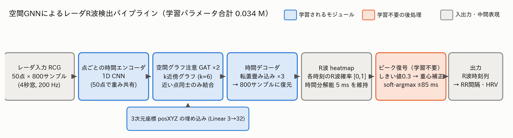
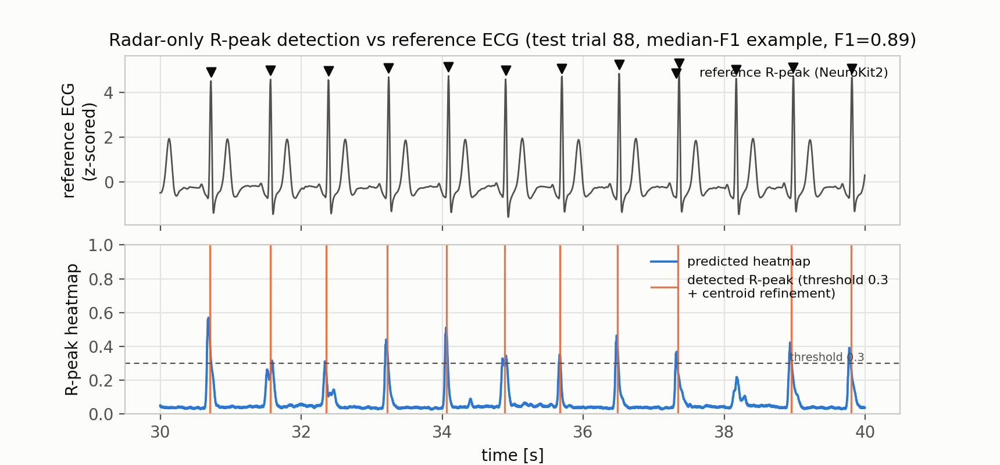
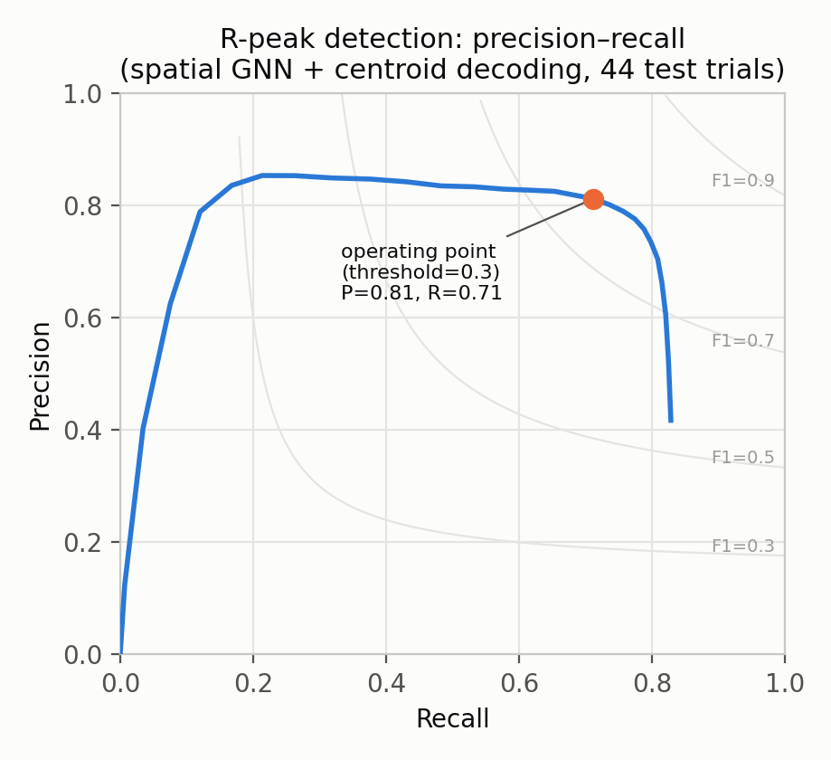
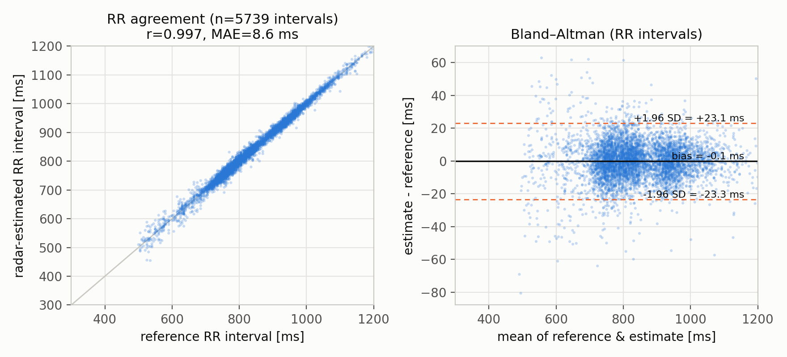

# ミリ波レーダによる非接触心拍計測：進捗報告（フル版）

2026-08-07 ／ 発表用の要約は [presentation_2026-08-07.md](presentation_2026-08-07.md)．
実験の時系列ログは [findings_2026-08-07_rpeak_heatmap_investigation.md](findings_2026-08-07_rpeak_heatmap_investigation.md)．

## 0. 成果要約

ミリ波レーダの反射信号だけから心電図の R 波タイミングを検出し，HRV（心拍変動）指標を算出するモデルを，公開ヒトデータセット MMECG（テスト 3 被験者・44 トライアル）上で確立した．

- **最終構成**: 空間 GNN（0.034 M パラメータ）＋ ガウシアン heatmap 教師（σ=15 ms，NeuroKit2 による R 波ラベル）＋ サブサンプル重心復号（±85 ms 窓の soft-argmax）
- **性能**: R 波検出 F1 0.749 ／ RR 間隔 MAE 8.41 ms ／ RMSSD MAE 10.27 ms．RR 間隔を報告する近縁研究（ICASSP 2024: 中央値 12 ms・RMSSD 誤差 7.3 ms）と同水準
- **計算コスト**: 4 秒窓あたり CPU 11.5 ms（先行実装の約 700 分の 1）．エッジデバイスでの常時稼働が現実的な規模
- 8/5 時点からの伸び（F1 0.383→0.749，RR-MAE 9.67→8.41 ms，RMSSD-MAE 27.4→10.3 ms）は，モデル本体ではなく**教師ラベルの修正・教師幅の調整・復号の高精度化**の 3 点から得られた（§6）．アーキテクチャとパラメータ数は不変

## 1. 使用データセットと先行研究

公開されているヒトのミリ波レーダ & 心電図同時計測データセット MMECG を用いて学習した．犬で学習する前段として，ヒトの公開データで手法を確立する段階にあたる．

| | データセット原著 [1] | 直接の出発点（コードベース）[2] |
|---|---|---|
| 論文 | Chen et al., "Contactless Electrocardiogram Monitoring With Millimeter Wave Radar" | Zhang et al., radarODE / radarODE-MTL |
| 掲載 | IEEE T-MC 23(1):270–285, 2024 | IEEE T-MC 2025 / IEEE T-IM 74, 2025 |
| 所属 | 中国科学技術大学（USTC） | 西交利物浦大学（蘇州）ほか |
| 内容 | ビームフォーミング等の信号処理で心臓由来の微小運動を 4 次元抽出し，Transformer + TCN で ECG へ変換 | 心電波形の常微分方程式をデコーダに埋め込む．MTL 版は 3 タスク（波形・拍間隔・R 波位置）に分解 |
| 成績 | RR 間隔誤差 中央値 3 ms（35 参加者・200 トライアル） | 検出漏れ率 0〜3.34%，波形相関 89.6%（11 参加者・91 トライアル） |

**比較の非対称性（重要）**: 公開されているのは一部（11 参加者・91 トライアル・4.55 時間）．さらに信号処理側のコードは非公開であり，学習側の入力に使う時間–周波数変換（SST）も切り出し方が非公開のため Python で真似て実装している．したがって原著の 3 ms を我々の数値と直接比較することはできない．以降の比較はすべて，入力・分割・評価コードを手元で統一したうえでのモデル間の比較である．

## 2. タスクの定義と評価条件

- **入力**: レーダの 50 点分の反射信号 RCG（200 Hz）．4 秒 = 800 サンプルを 1 窓として (50 チャネル, 800 サンプル) を入れる．各点には 3 次元座標 posXYZ が付随する（記録中は不変）
- **出力（主タスク）**: 800 サンプル分の heatmap（各時刻に R 波がある確からしさ，[0,1]）．教師信号は参照 ECG の R 波位置に σ = 15 ms のガウシアンを立てたもので，物体検出でいうキーポイント検出（CornerNet 等 [4]）と同じ実装（σ は 10/15/20 ms の単一変数比較で 15 ms を採用）．正解 R 波位置は当初の自作 z-score 検出器が T 波を誤検出する問題が見つかったため，標準ライブラリ NeuroKit2 [3] による検出に置き換えた（全 91 トライアル再ラベル付け）
- **推論時のピーク復号**: 連続 heatmap から固定しきい値 0.3 の極大点選択で候補を取り，各候補の ±85 ms 窓で heatmap の重み付き重心（soft-argmax [5]）を 2 回反復してサブサンプル精度（200 Hz の 5 ms 刻みより細かい連続値）に補正する．姿勢推定分野で heatmap の argmax 量子化誤差を分布形状で補正する枠組み [5][6] の 1 次元版．この重心復号だけで RR 間隔 MAE は 11.8 → 8.4 ms に改善した（学習不要の後処理）
- **指標**:
  1. **F1**: 予測ピークと正解 R 波を ±50 ms 以内で対応づけた検出性能
  2. **RR-interval MAE**: 連続する R 波の間隔の誤差（HRV に直結する主指標）
  3. **RMSSD MAE**: 実際に使う HRV 指標そのものの誤差
- **推論の与え方**: 録音全体を 0.25 秒ステップのスライディング窓で走査し，重複区間の予測を平均で融合して 1 本の連続 heatmap にしてからピーク検出する．RMSSD 算出時は標準的な異常 RR 除去（生理的にありえない間隔と局所中央値から 20% 以上外れた間隔を除去）を通す
- **参加者ごとのデータの分割**: train 7 ／ val 1 ／ テスト 3

## 3. 時間分解能のボトルネック解消

先行実装の学習側パイプラインは，ピーク検出の前に時間分解能を大きく落としている．

- SST（時間–周波数変換）で 800 サンプル → 120 フレーム（6.7 倍）
- バックボーン内の stride 付き畳み込みで 120 → 31 ステップ（さらに 3.87 倍）
- 合計約 25.8 倍．1 サンプル = 5 ms だったものが，デコーダの入力時点で 1 ステップ ≒ 129 ms になっている

RR 間隔の誤差はピーク位置の誤差そのものなので，これが直接の律速になる．そこで時間–周波数変換もダウンサンプリングも行わず，**生の時系列のまま 200 Hz の分解能を出力まで保つ設計**に切り替えた．

## 4. モデル

### 4a. モデル1: 生信号 Anchor CNN（1 次元 CNN，0.356 M パラメータ）

入力 (50, 800) → 膨張畳み込み（dilated Conv1d）6 層 → 1×1 畳み込みヘッド → sigmoid → 出力 (800,)．各層は BatchNorm1d + ReLU + Dropout(0.1) を伴い，チャネル数 64，カーネル長 15．損失は heatmap への BCE，Adam，lr = 5e-4．

膨張畳み込みはカーネルのタップ間隔を空けて畳み込む手法で，層ごとに間隔を 1, 2, 4, … と倍にすればプーリングを一切使わずに受容野だけを指数的に広げられる（6 層で ±2.2 秒をカバー）．padding="same" により系列長は全層で 800 のままなので，入力の 1 サンプル（5 ms）と出力の 1 サンプルが 1 対 1 に対応する．

### 4b. モデル2: 空間 GNN（0.034 M パラメータ，最終採用）

50 個の反射点は胸郭上のばらばらの位置から返ってきた信号だが，モデル1 はこれを単なる 50 チャネルとして扱っており，どの点とどの点が空間的に近いかを使っていない．原著も 3 次元位置埋め込み + Transformer で空間構造を扱っており，押さえるべき情報だと判断した．構成は 4 段:

1. **点ごとの時間エンコーダ**: 50 点すべてに重みを共有した 1D CNN（stride 2 を 3 段）で各点を 32 次元の特徴系列にする
2. **位置の埋め込み**: 3 次元座標を線形層で 32 次元に写像して加算
3. **グラフ畳み込み**: 3 次元距離から k 近傍グラフ（k = 6）を作り，GATConv（注意機構つきグラフ畳み込み）を 2 層．全結合の自己注意と違い，物理的に近い点どうしだけを結ぶ帰納バイアスを入れている
4. **時間デコーダ**: 点方向に平均プーリングし，転置畳み込み 3 段で 800 サンプルに戻して sigmoid

点ごとに重みを共有しているため，50 点を処理しても重みは 1 点分しか持たない（0.034 M を実現）．

## 5. 比較

入力・分割・評価コードを統一した比較．前処理は再現できていないため，論文記載の値ではなく原著の実装を手元の環境で学習させた結果と比べている．

| モデル | 入力 | パラメータ数 | F1 | RR-interval MAE | RMSSD MAE |
|---|---|---|---|---|---|
| 原著EGA（3 タスク同時学習） | SST（50×71×120） | 37.71 M | 0.164 | 34.64 ms | 31.97 ms |
| 原著 単一タスク | SST（50×71×120） | 26.83 M | 0.180 | 約 31 ms | — |
| 生信号 Anchor CNN 64ch | 生信号（50×800） | 0.356 M | 0.570 | 15.43 ms | 46.46 ms |
| 空間 GNN（posXYZ，8/5 時点） | 生信号 + 座標 | 0.034 M | 0.383 | 9.67 ms | 27.38 ms |
| **空間 GNN + 重心復号（8/7 最終，※）** | 生信号 + 座標 | **0.034 M** | **0.749** | **8.41 ms** | **10.27 ms** |

※ 最終行のみ，正解 R 波を NeuroKit2 に置き換えた再ラベル後の評価（§6）．上 4 行は旧ラベル（T 波誤検出を含む）での 8/5 時点の値であり，正解の作り方が異なるため厳密には同一条件でない点に注意．

1. **時間分解能を保持した設計が効いている**．F1 は 4.2 倍（0.18→0.75），RR 間隔 MAE は 1/4.1（34.6→8.4 ms）
2. **精度向上がパラメータ増加を伴っていない**（0.034 M のまま）
3. 8/5 時点で課題だった「検出性能（F1）とタイミング精度の両立」は，教師ラベルの修正と復号の改善（§6）により**単一モデルで両立**できた（F1 0.383→0.749 と RR-MAE 9.67→8.41 ms を同時に達成）

**先行研究との関係**:

1. radarODE 系は我々と全く同じ 11 参加者・91 トライアルを使っているが，RR 間隔誤差を報告しておらず（指標は検出漏れ率と波形の RMSE・相関），直接は比べられない．また彼らは 11-fold の交差検証（毎回 10 参加者で学習）で，我々の 7 参加者の学習より有利な設定．手元で原著実装を再学習して得た F1 0.164 は論文値から大きく劣化しており，前処理を再現できていないことが主因かと思われる
2. RR 間隔で測っている研究: USTC の後続研究（ICASSP 2024: 拍間隔誤差 中央値 12 ms・RMSSD 誤差 7.3 ms／Nature Communications 2024: 外来患者 6,222 名で 26.1 ms）．手元の 8.41 ms（RMSSD MAE 10.27 ms）はこれらと同水準に到達した．原著 MMECG の 3 ms（§1 の注のとおり直接比較不可）にはまだ差がある

## 6. 8/5 以降の改善: ラベル修正・教師幅・サブサンプル重心復号

8/5 時点の空間 GNN からの改善は，モデル本体ではなく**ラベル・教師設計・復号（後処理）**の 3 点から得られた（アーキテクチャとパラメータ数は不変）．

1. **正解 R 波ラベルの修正**: 自作 z-score 検出器が T 波を第二 R 波として誤検出し，教師ラベル自体が汚染されていた．NeuroKit2 [3] で全 91 トライアルを再ラベル付けし，heatmap が 1 心拍に 2 山出る R/T 混同が解消した
2. **ガウシアン教師の幅**: σ = 10/15/20 ms の単一変数比較で，検出率（F1）と位置精度（RR/RMSSD）のトレードオフの折衷点として σ = 15 ms を採用．チェックポイントは 5 epoch ごとに保存し，下流指標（F1/RR/RMSSD）で事後選択する（heatmap 相関での選択は下流精度と乖離するため）
3. **サブサンプル重心復号**: heatmap は 200 Hz（5 ms 刻み）に量子化されており，整数 argmax には量子化誤差とジッタが乗る．検出済みピークの ±85 ms 窓で重み付き重心（soft-argmax [5]，argmax 量子化補正 [6] の 1D 版）を取り連続値に補正する後処理を導入した．学習不要・CPU のみで，RR-MAE 11.8→8.4 ms・RMSSD-MAE 18.3→10.3 ms・F1 0.733→0.749 と**全指標が同時に改善**（位置が正確になり ±50 ms 対応付けも増えるため，検出と位置精度のトレードオフではない）

**棄却した案**（詳細は findings_2026-08-07）: R+T 両方を教師に含める案，復号と整合する soft-argmax 位置損失 [5][7] の追加，focal loss，前処理各種（バンドパス・EMA クラッタ除去・チャネル重み付け）は，いずれも 8 epoch プローブまたは本番学習で改善せず棄却した．価値が出た変更がすべてラベル・評価・復号の側だったことは，本報告全体の傾向（§8 の評価指標の知見）と一致する．

### 結果の図（いずれも test 3 被験者 44 トライアル，最終構成）

F1 が中央値のテストトライアルにおける参照 ECG + 正解 R 波（上段）と予測 heatmap + 検出 R 波（下段）の 10 秒間の定性例．

検出しきい値を 0.05〜0.9 で掃引した Precision–Recall 曲線．運用点（しきい値 0.3）は P=0.81 / R=0.71．recall はしきい値を下げても 0.83 で頭打ち（heatmap が立っていない見逃しは復号側では取り返せない）．

マッチ済み RR 間隔（n=5,739）の散布図（r=0.997）と Bland–Altman プロット [8]（バイアス −0.1 ms，95% 一致限界 ±23 ms）．HRV 計測手法の妥当性検証で標準的に用いられる形式．

（補助）教師 heatmap と推論 heatmap の対応を理解する参考図: `mmecg_comparison/heatmap_teacher_vs_inference.png`

## 7. エッジ実行性の実測

本 WSL2 環境（Intel Core i7-12700 / RTX 3060 Ti）で実測．batch = 1（4 秒窓 1 個），warmup 10 回・計測 50 回，CPU は組込み機を想定してスレッド数 4 に固定（Raspberry Pi 5 が 4 コアであることに合わせたプロキシ）．FLOPs は PyTorch 組み込みの torch.utils.flop_counter で求めた．

| モデル | パラメータ | サイズ（fp32※） | FLOPs | CPU（4 スレッド） | GPU | GPU メモリ |
|---|---|---|---|---|---|---|
| 原著EGA（3 タスク） | 37.71 M | 143.9 MB | 12.50 G | 136.7 ± 6.3 ms | 191.8 ms † | 268.3 MB |
| 原著（Anchor デコーダのみ） | 26.83 M | 102.4 MB | 11.93 G | 107.6 ± 5.3 ms | 11.5 ms | 225.8 MB |
| 生信号 Anchor CNN 64ch | 0.356 M | 1.36 MB | 0.568 G | 2.15 ± 0.12 ms | 0.98 ms | 2.5 MB |
| 空間 GNN | 0.034 M | 0.13 MB | 0.314 G | 11.46 ± 1.36 ms | 4.09 ms | 28.9 MB |

※ fp32 = 32 ビット浮動小数点（1 パラメータ 4 バイト）．エッジ展開では int8 量子化によりさらに 1/4 まで圧縮できる余地がある．
† EGA の GPU が CPU より遅いのは，波形デコーダに LSTM が含まれ逐次実行になるうえ，1 サンプルでは GPU の並列度を活かせずカーネル起動のオーバーヘッドが支配するため．

**前処理を含めると差が決定的になる**．原著は SST 変換が必須で，1 窓（4 秒・50ch）あたり 1517 ms（1ch 30.3 ms × 50ch）かかる．生信号側は切り出しと窓内 z-score のみで 0.12 ms．

| | 前処理 + 推論（CPU 4 スレッド） | 4 秒窓に対する占有率 |
|---|---|---|
| 原著（Anchor のみ） | 約 1625 ms/窓 | 41% |
| 生信号 Anchor CNN | 約 2.3 ms/窓 | 0.06% |
| 空間 GNN | 約 11.6 ms/窓 | 0.29% |

すなわち計算コストで約 700 倍，モデルサイズで約 1100 倍の削減．常時稼働を前提とする家庭設置型デバイスでは，この差がそのまま消費電力と発熱の差になる（GPU 消費電力はアイドル 9.35 W に対し，推論中の平均が原著EGA 40.8 W・生信号CNN 26.1 W・GNN 23.3 W）．時間–周波数変換を捨てて生信号を直接扱う判断が，精度とエッジ実行性の両方に同時に効いた．

**限界**: x86 の 4 スレッドは Raspberry Pi 5 より速いため実機では数倍のレイテンシになると見込まれる．それでも 4 秒窓に対して桁の余裕があり，実機でも常時稼働に問題はないと判断できる．Pi 4 や，ひと手間加えれば組み込み (ESP32) でも動作する可能性がある．次の障壁は，組み込みへの導入も想定した PyTorch への依存除去かもしれない．実機測定と全体の電力測定は残課題．

### Raspberry Pi 5 実機検証の準備状況（2026-08-07）

- 実機は Tailscale + SSH で WSL2 の Claude Code から `ssh raspi` で遠隔操作できるようセットアップする計画（[raspberrypi5_plan.md](mmecg_comparison_2026-08-05/raspberrypi5_plan.md)）
- **確定構成（284 epoch4 + しきい値 0.3 + 重心復号）の推論一式を `deploy/rpi5/` に配置済み**: エントリポイント `run_inference.py`・チェックポイント・最小 requirements・セットアップ手順（README）．WSL 側の CPU 4 スレッドスモークテスト通過（trial 48: 1 窓 9.8 ms，F1 0.940，RMSSD 誤差 0.76 ms）
- 懸案だった torch_geometric の ARM 対応は，コンパイル拡張（torch-scatter 等）なしの pure-Python フォールバックで動作することを確認済みでリスク解消

## 8. 波形推定の評価における副次的知見

副タスクの ECG 波形再構成で，相関を用いた評価に問題があることを発見した．波形の再現性は慣例的に Pearson 相関で測られ，我々のモデルは拍単位の相関 0.87 を示していたが，**レーダ入力を一切見ずに学習データの平均的な拍の形を出力するだけのモデルが 0.883**（中央値 0.935）であり，学習したモデルはこれを上回っていなかった．拍の区切り方を変えてもこの基準値は 0.79〜0.88 と高いままである．ECG の拍は個体差より共通形状（P-QRS-T）が支配的なため，平均形状を出すだけで高い相関が出てしまう．

さらに相関は平均・分散を正規化してから形だけを見る指標なので振幅のずれを検出できず，実際に相関 0.99 の例が相関 0.93 の例より RMSE が大きいケースを確認している．以降，**波形の相関を報告する際は入力を見ない平均形状モデルの値と RMSE を必ず併記する**．これは我々のモデル固有の問題ではなく，この種の研究に共通して見過ごされうる評価上の問題である（先行研究が報告する波形相関 89.6〜92.6% も，この基準値と近い水準にある）．

同種の落とし穴として，F1 は教師ガウシアンの幅（σ）を広げるだけで見かけ上改善する（±50 ms の対応付けに入りやすくなる一方で位置精度は悪化する）ことも確認しており，後処理・前処理・ラベル設計の評価は常に F1 と RR/RMSSD を併記して行っている．

## 9. 現時点の到達点と残課題

レーダ生信号を時間分解能を落とさずに扱う設計（空間 GNN）に，教師ラベルの修正（NeuroKit2）・教師幅の調整（σ=15 ms）・サブサンプル重心復号を加えることで，**R 波検出 F1 0.749・RR 間隔 MAE 8.41 ms・RMSSD MAE 10.27 ms を，0.034 M パラメータ・4 秒窓あたり CPU 11.5 ms**（エッジデバイスで常時稼働できる規模）で実現した．同一条件で比較した原著実装（26.8〜37.7 M パラメータ，前処理込み 1625 ms/窓）に対して，計算コストで約 700 倍の改善．8/5 時点で課題だった「検出（F1）とタイミング精度の両立」は単一モデルで解消した．

残課題:

1. **イヌのデータへの適用（最優先）**．ヒトの公開データ上の結果で，イヌにおける検証は未着手．イヌは心拍が速く（安静時 2 Hz 前後），体毛と体動があるため同じ設計が成立する保証はない
2. **検出率の上限**．PR 曲線（§6）のとおり recall は閾値を下げても 0.83 で頭打ちであり，heatmap 自体が立っていない見逃しは復号側では取り返せない．残る改善はモデル・入力側の課題として残る（学習側の工夫はこれまで全滅しており，優先度は慎重に判断する）
3. **データ規模と評価の安定性**．学習 7 名・検証 1 名では検証値が epoch 間で ±0.08 揺れる．先行研究と同じ 11-fold 交差検証に切り替えることも検討する．また 8 epoch プローブが本番 50 epoch で再現しない例（GPU 非決定性由来と推測）を確認しており，僅差の判断は複数 seed で行う
4. **Raspberry Pi 5 実機での測定**（推論パッケージは準備済み，§7）

**Part II の構想への接続**: HRV を「値」ではなく「時間変化 Δ」として使うため，変化点検出に耐える安定性の評価指標が要る．

## 参考文献

1. J. Chen et al., "Contactless Electrocardiogram Monitoring With Millimeter Wave Radar," IEEE Trans. Mobile Computing, 23(1):270–285, 2024.（MMECG データセット原著）
2. Y. Zhang et al., "radarODE / radarODE-MTL," IEEE T-IM 74, 2025.（コードベースの出発点）
3. D. Makowski et al., "NeuroKit2: A Python toolbox for neurophysiological signal processing," Behavior Research Methods, 53:1689–1696, 2021.（正解 R 波の再ラベル付け）
4. H. Law and J. Deng, "CornerNet: Detecting Objects as Paired Keypoints," ECCV 2018.（ガウシアン heatmap によるキーポイント検出の定式化）
5. X. Sun et al., "Integral Human Pose Regression," ECCV 2018.（soft-argmax による heatmap の連続座標復号．重心復号の直接の根拠）
6. F. Zhang et al., "Distribution-Aware Coordinate Representation for Human Pose Estimation (DARK)," CVPR 2020.（heatmap argmax の量子化誤差をピーク近傍の分布形状で補正する枠組み）
7. A. Nibali et al., "Numerical Coordinate Regression with Convolutional Neural Networks (DSNT)," arXiv:1801.07372, 2018.（soft-argmax を学習損失に使う枠組み．試したが棄却，§6）
8. J. M. Bland and D. G. Altman, "Statistical methods for assessing agreement between two methods of clinical measurement," The Lancet, 1986.（RR 間隔の一致度評価の図式）
9. J. Pan and W. J. Tompkins, "A Real-Time QRS Detection Algorithm," IEEE Trans. Biomedical Engineering, 1985.（適応しきい値 + searchback 型の後処理として比較検討．最終構成では固定しきい値 + 重心復号を採用）
