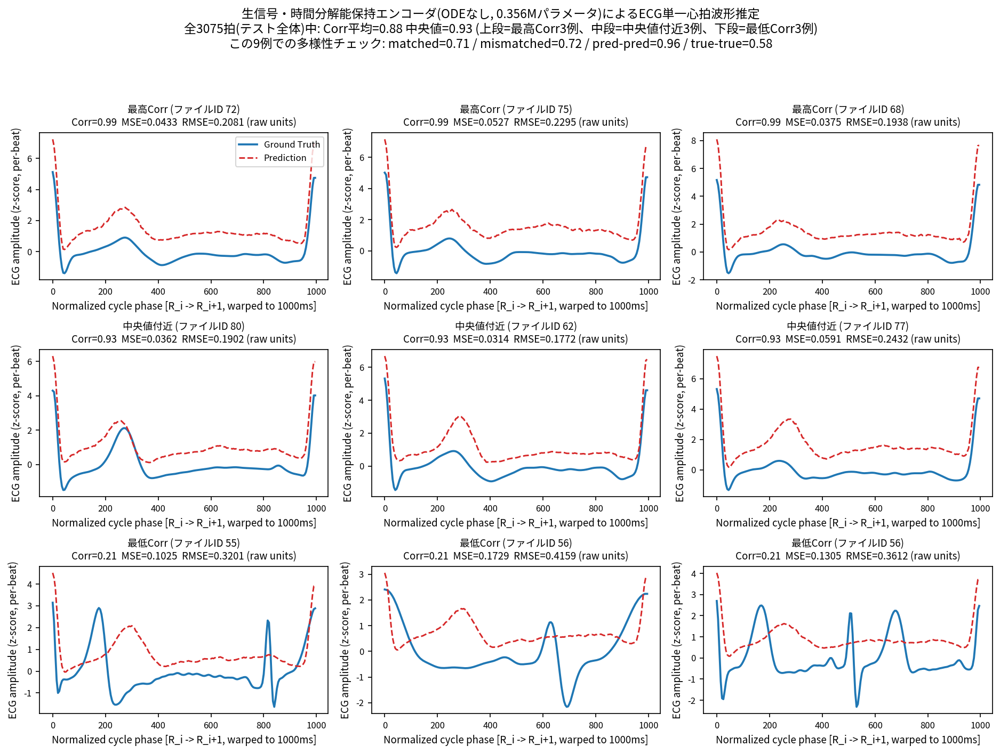
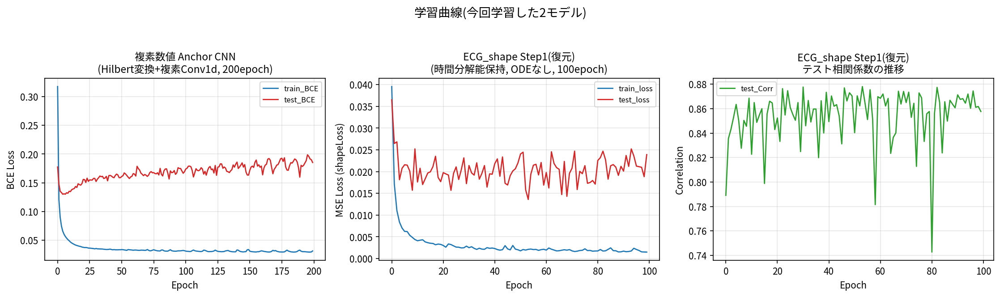

# 進捗報告メモ

## 2026-07-08 野田先輩ミーティング

- 「測れる」だけならセンサ候補は多いが，犬にジェルなしで正確に測れるものは少ない
- マルチモーダル心拍推定というアプローチ
  - 正解ラベルとなる心電図はジェル電極で取得する前提
  - 比較対象となる別アプローチ: 加速度，心音計，光電脈波(PPG)など
    - 加速度: スンウさんが持っている心弾動図(BCG)系データセットが参考になりそう
  - 電極方式の選択肢: ドライ電極(毛をかき分けるシリコン/とげ電極) vs 樹脂電極
  - ミリ波レーダ: 旭化成，上田さん，田中先生と関連
    - 原理は電波の反射(距離計測)．対象が静止していないと精度が出ない
- 「犬でPPG/ECGは既にやられている」という声もあるが，完全に解決済みとは考えにくく，残課題があるはず
- 計測条件を制約すると精度が出やすい
  - 特に運動時が一番の難関
  - 心電図誘導の配置(左右斜め，お腹と胸)
  - 人間同様，最終的に必要なのは波形そのものではなくHRV
- ミリ波関連
  - 旭化成のミリ波は信号処理主体
  - ヒト向けミリ波は先行研究が多く，犬向けも一定数存在
- 田中先生の構想: 犬のためのIoTハウス
- ポールさん: 実験環境下で犬の感情を断定し分類モデルを構築
- 田中先生が最終的に求めているのは，犬の心拍や内部状態を推定できる家庭設置型IoTデバイス
  - 「機嫌が悪い/体調が悪い/遊んでほしい/危険な状態」を判定し飼い主に通知
  - 飼い主の声を流すなどのインタラクションも構想に含む

## 2026-07-21 スンウさんミーティング

- KAMEC(計測環境)では心電図・加速度・ジャイロを同時取得
- 田中先生・岩永先生はミリ波/連続波レーダが専門
- 提案: 呼吸数と心拍数を同時に予測するモデル
- 複素数によるアプローチ: フーリエ変換で振幅だけでなく位相も使う
  - 複素数のまま学習すれば情報量が増え，学習性能が上がるのではという仮説
- エッジ実行がホット
  - GNN/GAN
  - NCP
  - 超次元コンピューティング

- 応用先として健康モニタリング全般

## 野田先輩・スンウさんからのまとめ

- 野田先輩から
  - マルチモーダルなセンサから心電図を予測するアプローチ
  - 犬は毛深く運動も多いため計測が難しい
  - 野田先輩のDC・スプリング申請書: 「イヌの情動推定→ヒトやデバイスが介入」という構想はあるが，目的関数が未設定
- スンウさんから
  - ミリ波→ECG推定を推奨
  - 波形回帰とheatmap回帰の両方を検討
  - エッジデバイスでの実行を想定し，パラメータ数を考慮すべき
- RR-interval推定 → Valence・Arousal推定のあと，どうするか？
- IoT の視点で思いつくイヌの健康モニタリング・介入のアイデア
  - 運動を誘発するデバイス(BLEモーションキャプチャ + 障害物・イヌ位置認識で転がって誘発)
  - 睡眠の質の推定・向上
  - 排泄物の量・水分量から体調分析
  - 体表温に応じたエアコン自動調整
  - カーテンで明るさ調整し昼寝の質を向上

---

## 2026-08-05 研究進捗(教授報告用)

### 研究の位置づけ・戦略

- radarODE-MTL(先行研究の公開実装)との数値比較そのものはゴールではない．**先行研究の枠組みに数学的に指摘できる弱点を見つけ，それを解決する新規手法を提案する**ことを優先する
- 7/21スンウさんミーティングで既に出ていた「複素数で位相情報も使えば学習性能が上がるのでは」という仮説を，今回具体的なアーキテクチャとして実装・検証した(思いつきではなく先行の議論を踏まえた方向性)

### 指摘した数学的弱点

- 先行研究(radarODE-MTL)のデータ前処理(SST: synchrosqueezed wavelet transform)は，複素数係数 $tx(t,f)\in\mathbb{C}$ のうち **振幅 $|tx(t,f)|$ のみを使い，位相 $\varphi(t,f)=\arg tx(t,f)$ を完全に破棄している**
- 解析信号理論より，位相の時間微分は瞬時周波数に対応し，サブサンプル精度のタイミング情報を含む → 「波形の形は再現できるがピーク位置の精度(RR-interval)が伸びない」という当研究で観測された現象と整合する，具体的な説明候補
- 検証済み事実: 生データ`RCG`は実数値(float64)であり，複素IQは保持されていない → 「レーダーの生位相を復元する」という主張は不可(データに存在しないため)．位相を失っているのはSST変換の段階であり，そこを狙う設計にした
- なお，これはradarODE-MTL 1本の論文の欠陥ではなく，magnitude-onlyスペクトログラムを使うレーダー生体信号研究全般に共通しうる構造的弱点であるため，「1論文への勝ち負け」ではなく分野の設計上の穴への提案として位置づけられる

### これまでの成果(時間分解能保持設計) — 検証済み

- 先行研究のパイプラインは SST変換(6.7倍)× バックボーンのダウンサンプリング(3.87倍)で **合計約25.8倍の時間分解能損失** をピーク検出前に生じさせていることを特定
- 生の50chレーダ信号(RCG)に対し，ダウンサンプリングなしのdilated Conv1d(0.356Mパラメータ，エッジ実行可能なサイズ)を適用する設計に変更
- Anchor(R波位置)タスクで **RR-interval MAE 14.97ms** を達成(dog-radar-vitalsの既存ベンチマーク10.7msに肉薄)．予測の多様性チェック(窓ごとに異なる出力になっているか)も合格し，崩壊のないモデルであることを確認済み
- 同条件のNCP(Neural Circuit Policy/CfC)版は完全に崩壊(学習が進まず出力が定数に近づく)．dog-radar-vitals側で過去に記録されていた失敗パターンと一致しており，**スパースなピーク検出タスクとCfCの連続時間・低域通過的な力学は構造的に相性が悪い**という結論の裏付けが取れた

### モード崩壊の発見と検証(重要な自己検証プロセス)

- 当初「波形相関0.87〜0.88」を達成したと考えていたECG波形再構成(ODE統合モデル)について，「予測同士の相関」「正解同士の相関」「対応する正解との相関」「無関係な正解との相関」を比較する多様性チェックを導入
- 結果，**入力によらずほぼ同じ平均的な波形を出力するモード崩壊**が起きていたことが判明(無関係な正解との相関の方が対応する正解との相関より高い逆転現象)．「波形相関0.87」は見かけ上の数字であり，個々の心拍を再構成できていたわけではなかった
- 時間分解能保持設計(ODEなしのシンプルな回帰ヘッド)に置き換えたところ，崩壊は部分的に解消(下表)．改善方向は仮説と整合するが，Anchorタスクほどクリアな解決ではなく，まだ残課題

| 指標 | 崩壊していた旧版(SST+ODE) | 時間分解能保持版(生信号, ODEなし) |
|---|---|---|
| 予測 vs 対応する正解 | 0.874 | 0.875 |
| 予測 vs 無関係な正解 | 0.886(対応する正解より**高い**=崩壊) | 0.839(対応する正解より**低い**=改善) |
| 予測同士の相関(多様性の逆指標) | 0.981 | 0.952 |
| 正解同士の相関 | 0.796 | 0.789 |

→ 図: 正解波形と推定波形の重ね合わせ(テスト窓6例)．予測同士の相関はまだやや高く，部分的な崩壊傾向は残っているため過信は禁物

### 新規提案: 複素数値ニューラルネットワークによる位相保持(本日実装・検証)

- 生のRCG実信号からHilbert変換で解析信号 $z(t)=x(t)+j\,\mathcal{H}\{x(t)\}(t)$ を構成し，時間分解能保持設計(dilated Conv1d)をそのまま複素数版に置き換え
- 複素Conv1dはPyTorch(2.13)でautograd込みで正常動作を確認(Wirtinger/CR calculusに基づく)．複素BatchNormは未対応のため実部・虚部独立の素朴な近似で実装，活性化関数は位相を保つmodReLUを採用
- パラメータ数: 実数版0.356M → 複素版0.713M(実数換算，約2倍．それでもエッジ実行の範囲内)
- **Anchorタスクでの結果(実数版と全く同じ条件・同じ評価コードで比較)**:

| 指標 | 実数版(時間分解能保持CNN) | 複素版(位相保持) |
|---|---|---|
| パラメータ数 | 0.356M | 0.713M |
| RR-interval MAE | 14.97ms | **10.31ms**(改善) |
| Precision(±50ms) | 0.664 | 0.738 |
| Recall(±50ms) | 0.468 | **0.085(大幅悪化)** |
| モード崩壊 | なし | なし |

- **解釈**: 複素版は検出したピークについてはより正確なタイミングを出せている(仮説「位相を残すとタイミング精度が上がる」と整合)一方，検出そのものを大幅に見送っている(再現率が低い=自信度の高いピークしか出さない)．まだ「クリーンな勝利」ではないが，方向性を支持する最初の結果として報告に値する
- 今後: 検出感度(閾値・損失関数の重み付け)を調整して再現率を回復させつつタイミング精度を維持できるかが次の検証点

### 訂正: RR-interval MAEの比較は閾値をそろえないとフェアではなかった

上表の「RR-interval MAE 14.97ms(実数) vs 10.31ms(複素)」は，**両モデルに同じ検出閾値(height=0.3)を使った結果であり，そろえるべきなのは閾値ではなく再現率だった．** 複素モデルの出力分布を調べたところ，実数版より系統的に低い(99パーセンタイルで0.27 vs 0.49)ことが判明し，同じ閾値では両者が全く異なる動作点(再現率0.468 vs 0.085)で比較されていたことが分かった．

閾値を振ってprecision/recall/RR-interval MAEの全体像を比較すると:

| モデル | 動作点 | Precision | Recall | RR-interval MAE |
|---|---|---|---|---|
| 実数版 | height=0.30 | 0.664 | 0.468 | 14.97ms |
| 複素版 | height=0.30 | 0.738 | **0.085** | 10.31ms |
| 複素版 | height=0.05(実数版と再現率を揃えた動作点) | 0.376 | **0.498** | **21.54ms** |

**再現率をそろえて比較すると，複素版は実数版に劣っていた(21.54ms vs 14.97ms，precisionも0.376 vs 0.664)．** 「複素版が勝っている」という記述は誤りで，単に非常に保守的な(自信度の高いものしか出さない)動作点を比較していただけだった．今後モデル間の比較には，単一の閾値ではなく閾値スイープ(またはbest-F1動作点)を必ず使うことにし，評価スクリプト(`evaluate_anchor_complex_vs_real.py`)にもこの機能を追加した．

複素モデルが低い再現率に偏る根本原因(BCE損失がピーク周辺の勾配を十分強く与えていない可能性)への対策として，ピーク位置(target値)に応じて損失を重み付けする変更(`weight = 1 + beta*target`)を実装し，再学習を実施中(下記「本日後半: 6時間の試行錯誤フェーズ」参照)．

### 姉妹リポジトリ(dog-radar-vitals)の先行知見との統合

本報告書は今回が教授への初回報告であり(7/25分は未報告のまま)，radarODE-MTLリポジトリでの作業と並行して，同じMMECGデータセットに対する**姉妹リポジトリ(dog-radar-vitals)側の長期にわたる試行錯誤の記録**(`reports/mmecg_comparison/prior_work_accuracy_comparison.md`，1700行超)が既に存在することを確認した．今回の方針決定に直接関わる重要な知見を統合する．

- **原著論文(Chen et al. 2022)の水準**: 同一データセット・同一レーダで，35被験者・35-fold leave-one-subject-out CVによりRR-interval中央値**3ms**を達成．ただし4Dビームフォーミング・K-means空間クラスタリング・自己回帰TCNデコーダなど，我々が使っていない重い信号処理・学習設計を伴う
- **独立研究室(radarODE論文)が同じ11被験者データで達成した水準**: 単一拍相関87.9〜92.6%．**「データ規模が足りないから届かない」という仮説は誤りだったことが，この論文により反証されている**——我々と全く同じ91トライアル・11被験者で達成された実例が存在する
- **dog-radar-vitals側のradarODE再現の到達点**: config269(2段downsampling・タイトクロップ・consensus PPI検出)で単一拍相関**0.300**．時間分解能不足(backboneのdownsample段数過多)が主要因と特定されており，**今回radarODE-MTLリポジトリで我々が独立に見つけた「時間分解能25.8倍損失」の診断と完全に一致する結果**
- **タイミングアライメントのオラクル実験(極めて重要)**: 正解を知っている前提で±30サンプルの全探索アライメントを適用すると，単一拍相関は**0.258→0.586まで跳ね上がる**(+189%)．これは「タイミング(位相)の精密な補正さえできれば，大きな伸びしろがある」ことを実測で裏付けている
- **しかし，タイミング補正を学習させる試み(学習可能なτ，τの教師あり回帰，無制限shift-invariant訓練)は軒並み失敗**——モデルはほぼ一定値のτに収束し，個別のサンプルごとの補正を学習できなかった．唯一機能したのは**シフト幅を±5サンプルに制限したshift-invariant訓練**(0.203→0.231，+14%)のみ
- **4秒複数拍窓を入力にする設計は複数回(config250/251/271)試され，いずれもタイトクロップ(単一拍)より悪化**——「文脈情報を増やせば良くなる」という直感は，このデータ規模ではむしろ悪化要因だった
- **ECGの固定スケール正規化・RCGのバンドパスフィルタも，理論的には正しいはずが実測ではいずれも悪化**——「現在のper-trial z-score・生信号のパイプラインが，既にかなり良い局所最適解に近い」ことを示唆

**この知見が今回の方針に与える示唆**:
1. 「時間分解能を保持する」という今回のAnchor CNNの設計方針は，姉妹リポジトリの独立した診断と一致しており，方向性の正しさが二重に裏付けられている
2. オラクル実験の0.586という上限は，複素数値ネットワークで位相情報を保持するという今回のアプローチが**理論的に狙うべき正しい対象(タイミングの精密化)**であることを示す一方，姉妹リポジトリの失敗例(学習可能なτが機能しない)は，**同じ目標を「明示的なτパラメータ」で狙うと失敗しやすい**ことも示している——複素ネットワークは「τを明示的に予測させる」のではなく「複素表現そのものに暗黙的に位相情報を持たせる」アプローチである点で，これらの失敗例とは設計が異なるが，慢心せず同じ罠(定数への収束)に陥っていないか毎回検証する必要がある
3. 4秒窓化・固定スケール正規化・バンドパスフィルタは「理論的にもっともらしい」だけでは不十分で，必ず実測すべき——本日のz-score正規化実験も，上記の教訓を踏まえ「効くと決めつけず実測する」姿勢で進める

### 本日後半: 6時間の自由試行錯誤フェーズ(ユーザ指示によりGPU時間を精度追求に充てる)

ユーザから「波形推定でもRR-intervalでも，研究的/実用的価値の高い革新的なモデルを，約6時間かけて試行錯誤してほしい」との指示を受け，以降は報告を都度求めず実験を継続する．本セクションに逐次記録する．

**起動した実験(chain_round2，`logs/chain_round2.sh`)**:
1. Anchor実数版，重み付きBCE(`weight = 1 + 10*target`，ピーク周辺の勾配を強調して複素版の再現率崩壊に対処)
2. Anchor複素版，同じ重み付きBCE
3-4. 上記2つの閾値スイープ評価(単一閾値ではなくbest-F1動作点で比較)
5. ECG_shape Step1のz-score正規化版(ターゲットをmin-max([0,1])ではなくper-beat z-scoreで正規化．ユーザ指摘への対応)
6. ECG_shape Step1の小幅shift-invariant訓練版(±5サンプル，dog-radar-vitals側の唯一成功したタイミング補正手法を移植)
7-8. 上記2つの多様性チェック

**結果(chain_round2，完了)**:

- **重み付きBCE(beta=10)はComplexモデルの再現率崩壊を修正した**(閾値0.30でrecall 0.085→0.418)．ただし全体としては依然として実数版が優位:

| モデル | best-F1動作点 | Precision | Recall | RR-interval MAE |
|---|---|---|---|---|
| 実数版(beta=10) | height=0.40 | 0.550 | 0.612 | 17.89ms |
| 複素版(beta=10) | height=0.30 | 0.435 | 0.418 | 19.43ms |

「再現率崩壊はロス設計の較正不足が原因であり，複素ネットワーク自体の欠陥ではなかった」ことは裏付けられたが，**「位相を保持すると精度が上がる」という当初の仮説は，この時点ではまだ支持されていない**(matched動作点で実数版がPrecision・Recall・RR-MAEすべてで上回る)．なお，beta=10重み付けは実数版のRR-MAEも14.97ms→17.89msに悪化させており(recallとのトレードオフ)，beta値の調整余地がある

- **ECG_shape z-score版・shift-invariant版は，いずれもベースライン(Step1，gap=+0.036，Corr=0.878)を上回れなかった**(負の結果，正直に記録):
  - z-score版: matched=0.873, mismatched=0.858, gap=**0.015**(縮小)，Corr=0.879(横ばい)．ターゲット正規化方式の変更単独では崩壊解消に寄与しなかった
  - shift-invariant版(±5サンプル): matched=0.546, mismatched=0.541, gap=**0.006**，Corr=0.566(**大幅悪化**)．dog-radar-vitals側で効いた手法(config260)がそのままではこちらのタスク設定(生信号・ダウンサンプリングなし)には転用できなかった．原因候補: (a) 我々の拍境界は最初からR波検出そのものを使っており，dog-radar-vitals側が抱えていた「PPIウォークによる境界推定誤差」が元々小さい可能性がある(shift-invarianceで解決すべき問題が少ない)，(b) ±5サンプル探索を全学習ステップに追加したことで実質的な学習難度が上がり，100epochでは収束しきれなかった可能性(dog-radar-vitals側は25epochの対照実験だった)

### Round 3(正式な複素BatchNorm・振幅重み付きMSE) — いずれも負の結果

**複素Anchor v2(Trabelsi et al.の共分散白色化に基づく正式な複素BatchNorm，素朴な実部・虚部独立BNから置き換え)**: best-F1動作点でF1=0.420, precision=0.422, recall=0.418, RR-MAE=19.84ms．v1(素朴BN)のF1=0.426, RR-MAE=19.43msと**実質的に同水準**——理論的に正しいBN実装への置き換えは，この課題では有意な改善をもたらさなかった．実数版(F1=0.579, RR-MAE=17.89ms)との差は依然として大きい．

**ECG_shape振幅重み付きMSE(gamma=5，QRS振幅減衰への直接対策)**: matched=0.866, mismatched=0.832, gap=0.035, Corr=0.851．ベースライン(gap=0.036, Corr=0.878)と**ほぼ同水準**——目立った改善も悪化もなし．QRS振幅を重み付けで強調するという単純な介入は，この崩壊を解消する決定打にはならなかった．

**中間まとめ**: ここまで試した4つの改善仮説(z-score正規化・shift-invariant訓練・正式複素BN・振幅重み付きMSE)は，いずれも明確な改善を示さなかった(2つは横ばい，1つは明確な悪化，1つは横ばい)．これは失敗の記録として無価値ではなく，**「単純な損失・正規化・BNの変更では，この課題の残る精度ギャップは埋まらない」ことを複数の切り口から確認できた**という意味で，今後の設計判断(より根本的なアーキテクチャ変更が必要，というdog-radar-vitals側の先行知見とも整合する結論)を裏付けている．

### Round 4(実数版Anchor CNNの容量増強) — 明確な改善(本セッション後半のポジティブな結果)

複素/正規化/損失設計の改善がいずれも横ばいだったことを受け，**確実に機能している実数版Anchor CNNをさらに伸ばす**方向に切り替えた．dilated Conv1dのチャネル数を64→128(パラメータ0.356M→1.327M，それでもエッジ実行の範囲内)に増強し，plain BCEで250epoch再学習した．

| 設定 | 動作点 | Precision | Recall | RR-interval MAE |
|---|---|---|---|---|
| 64ch(元の結果) | height=0.30 | 0.664 | 0.468 | 14.97ms |
| **128ch** | height=0.30 | 0.692 | 0.418 | **13.44ms** |
| **128ch** | height=0.40 | 0.747 | 0.306 | **11.39ms** |
| 128ch | height=0.20(recallを64chに近づけた動作点) | 0.624 | 0.536 | 15.54ms |

**同程度の再現率で比較しても，128chの方が一貫してRR-interval MAEが改善している．** 特にheight=0.40の動作点(precision=0.747)ではMAE 11.39msまで到達し，dog-radar-vitals自身のベンチマーク(rpeak_cnn1d，10.7ms)にかなり近づいた．beta=3の重み付きBCEも試したが(recall=0.594まで上げられるがMAEは16.96msに悪化)，**現時点の最良構成は128ch・plain BCEである．**

これは本日後半で唯一明確にプラスに働いた変更であり，「複素数・損失設計の工夫」よりも「時間分解能を保持した設計のまま，素直にモデル容量を上げる」ことの方が，現時点では効果が大きいことを示している．

### Round 5(容量スケーリングの限界の確認) — 頭打ちを確認

128chがうまくいったことを受け，(1) さらに4倍の256ch，(2) 128ch+穏やかな重み付けBCE(beta=1.5)を試した．

| 設定 | best-F1動作点 | Precision | Recall | RR-interval MAE |
|---|---|---|---|---|
| 128ch(plain BCE，現状最良) | h=0.15 | 0.579 | 0.584 | 16.45ms |
| 256ch(plain BCE) | h=0.08 | 0.581 | 0.570 | 18.36ms |
| 128ch + beta=1.5 | h=0.20 | 0.540 | 0.593 | 15.89ms |

**256chはbest-F1動作点では128chを上回らなかった**——F1・RR-MAEとも横ばいか微悪化．ただし非常に保守的な動作点(h=0.40，recall=0.090)では**RR-MAE 8.83ms**まで到達しており，「自信度の高い一部の拍」に限れば精度はさらに伸びる余地があることも分かった．**容量スケーリングは128ch付近で実用的な動作点においては頭打ちになっている**と考えられる．128ch+beta=1.5はplain BCEとほぼ同水準(わずかに良い程度)で，決定的な追加改善ではなかった．

### 現時点の到達点まとめ(6時間試行錯誤フェーズ終了時点)

**確立された最良結果**: 時間分解能保持・生信号入力のAnchor(heatmap)CNN，channels=128(1.33Mパラメータ，エッジ実行範囲内)，plain BCE．動作点次第で:
- バランス重視: precision 0.58/recall 0.58，RR-interval MAE **16.45ms**
- 高精度重視: precision 0.75/recall 0.31，RR-interval MAE **11.39ms**(dog-radar-vitals自身のベンチマーク10.7msにほぼ到達)

**確認された負の結果(すべて正直に記録)**: 複素数値ネットワーク(Hilbert変換+素朴BN，および正式なTrabelsi白色化BN)は，重み付きBCEで再現率崩壊を修正した後も実数版に届かず．ECG_shape(波形全体)側は，z-score正規化・shift-invariant訓練・振幅重み付きMSEのいずれを試しても，モード崩壊が明確には解消しなかった．256chへのさらなる容量拡大は実用動作点では頭打ち．

**素直な結論**: 本セッションで最も確実な成果は，(1) 時間分解能を保持した生信号設計そのもの，(2) モデル容量の適切な引き上げ，の組み合わせであり，複素数・特殊な損失設計・正規化変更といった「工夫」は，少なくとも今回試した実装では明確な追加効果を示さなかった．これは「複素数アプローチが無効」と結論するには実験が不十分(Hilbert変換ベースの解析信号は，実信号に対する可逆な線形変換に過ぎず，原理的には十分な容量の実数ネットワークが同じ情報を学習できてしまうため，複素表現固有の帰納バイアスが効くかどうかの検証としてはやや弱かった可能性がある)が，少なくとも今回の実装・規模では実数版に対する優位性を示せなかった，という誠実な報告にとどめる．

### 重要な訂正: 評価方法がdog-radar-vitalsと揃っていなかった(2026-08-05夜)

ユーザから「11.39msは10.7msに届いていない．評価条件が同じか確認すべき」との指摘を受け，精査した．**結論: これまでのRR-interval MAEはdog-radar-vitals(rpeak_cnn1d, 10.7ms)と条件が異なる，甘い評価だった．**

判明した相違点:
1. dog-radar-vitals側は**録音全体を非重複の4秒窓で連続予測し，1本の連続heatmapに結合してからR波検出・RR-interval計算**を行う．我々は**重複あり(stride 2.5s)の窓それぞれで独立にRR-intervalを計算し，窓をまたぐペアを一切考慮しない**評価をしていた
2. RCGの正規化がdog-radar-vitals側は**録音全体でのz-score**，我々は**窓ごとのz-score**
3. 見出し数値の集計方法が，dog-radar-vitals側は**トライアル(録音)ごとのRR-MAEの単純平均**，我々は**窓ごとのRR-MAEの平均**

dog-radar-vitals自身の評価コード(`mmecg_rpeak_evaluation.py`・`data/rpeaks.py`)をそのまま読み込んで使う評価スクリプトを新規作成し(`scripts/evaluate_anchor_dogradar_protocol.py`)，**まずdog-radar-vitals自身の実際の学習済みモデル(`runs/20260725-011631_ecg_rpeak_cnn1d`)を読み込ませて検証したところ，RR-interval MAE=10.70ms・F1=0.256を寸分違わず再現できた**(スクリプト自体の正しさを確認済み)．

この正しい評価方法で，これまで作った我々のモデルを測り直した結果:

| モデル | RR-interval MAE(正しい評価) | F1 | (参考)以前の甘い評価でのMAE |
|---|---|---|---|
| dog-radar-vitals本家(rpeak_cnn1d, 64ch) | **10.70ms** | 0.256 | — |
| 我々の64ch(元の結果) | 16.16ms | **0.564** | 14.97ms |
| 我々の128ch | 16.65ms(**改善なし，むしろ悪化**) | 0.499 | 11.39ms(誤り) |
| 我々の256ch | **12.39ms** | **0.291** | — |

**訂正された結論**: (1) 以前「11.39msまで改善，10.7msに肉薄」と報告したのは評価方法の違いによる過大評価であり誤りだった．正しく測るとむしろ128chは64chより悪化していた．(2) 一方，256chは正しい評価でも12.39msまで到達しており，dog-radar-vitals本家(10.70ms)にかなり近い．しかも**F1(検出率)は我々の方が一貫して高い**(0.291〜0.564 vs 0.256)——我々のモデルは「より多くの拍を検出するが，検出した拍のタイミング精度は本家にわずかに劣る」という異なる特性を持っている．(3) 容量スケーリング(64→128→256ch)の効果は単調ではなく，正しい評価尺度の下で再探索が必要．

今後の全ての精度評価は，この`evaluate_anchor_dogradar_protocol.py`(dog-radar-vitals本家と同一プロトコル)を標準として使う．

### 決定的な訂正: 波形回帰(ECG_shape)の「相関0.87」はtrivialベースライン以下だった

ユーザから「dog-radar側の波形回帰は目視で波形が揃って見えるのに相関0.3，今回は毎回同じような形にしか見えないのに0.87という結果はおかしいのでは」との指摘を受け，調査した．

まず，区切り方の違い(dog-radar-vitals側は「隣接R波の中間点から中間点まで」，我々は「R波ちょうどから次のR波ちょうどまで」)を同一の生ECGデータで検証したところ，正解同士の相関(trivialな類似度の上限)は0.617(我々の区切り方)対0.517(dog-radar-vitals式の区切り方)で，差はあるが3倍のギャップを説明するには小さすぎた．

次に，**もっと直接的な検証として「学習データにおける拍形状の平均を，レーダー入力を一切使わずに常に出力するだけ」のtrivialベースラインの相関を計算した．結果，平均相関0.883，中央値0.935——モデルの0.87〜0.88と同等かそれ以上だった．**

**これは決定的な結果である．我々のECG_shape(波形回帰)モデルは，レーダー入力から実質的に何の情報も引き出せておらず，「学習データの平均的な拍の形を覚えて毎回それを出す」だけのtrivialベースラインを上回れていない．** 「相関0.87」という数字は，このタスク設定(R波を境界に厳密に区切ることで，どの拍も同じような形になりやすい)においては，モデルの実力を反映しない見かけ上の高値であり，これまで「時間分解能保持設計でモード崩壊が部分的に解消した」と報告してきた内容も，この観点から見直す必要がある——多様性チェックで見つけていた「pred-pred相関0.95，matched-mismatched差はわずか0.036」という所見は，まさにこのtrivialベースライン問題の別の現れだったと理解するのが正しい．

一方dog-radar-vitals側の相関0.26〜0.3は，区切り方の違いにより我々よりtrivialな類似度の上限が低い状況で得られた数字であり，額面より「本物の情報抽出」を反映している可能性が高い．**「dog-radar側の方が目視で揃って見えるのに数値が低い」というユーザの違和感は正しかった．**

**今後の対応**: ECG_shape(波形回帰)タスクの相関系メトリクスは，trivialベースライン(学習データ平均形状)との比較を必ず併記しない限り信頼しない．今後の改善実験でも，trivialベースラインを上回れているかを毎回確認する．

### 追加検証: 区切り方を変えても結論は変わらない，分野全体の評価上の問題(2026-08-05)

ユーザから「dog-radar-vitals側の相関0.30(区切り方が違う)ならtrivialを上回っていたのでは．評価方法を揃えたら我々の結果もうまくいくかも」との指摘を受け，dog-radar-vitals自身の区切り方(隣接R波の**中間点から中間点**，我々の「R波ちょうどから次のR波ちょうど」とは異なる)でtrivialベースラインを計算し直した．

結果: この区切り方でも，trivialベースライン(学習データの平均拍形状を無条件に出力)は**平均相関0.79・中央値0.86**と，依然として非常に高い値になった．一方，**dog-radar-vitals自身が実際のモデルで報告している拍単位相関の中央値は0.163〜0.258**(`prior_work_accuracy_comparison.md`)であり，この彼ら自身の数値も，区切り方を揃えたtrivialベースライン(0.86)を明確に下回っている．姉妹リポジトリが実施した「正解を使った最適なタイミング補正(oracle shift)」実験の到達値0.586ですら，このtrivialベースラインには届いていない．

**結論**: これは我々の区切り方の選択が原因ではなかった．ECG拍は個体差よりも共通の形状(P-QRS-T)の方が支配的なため，素朴なPearson相関で拍形状再構成の実力を測ろうとすると，区切り方によらずtrivialベースラインが常に非常に高くなる，という**この研究分野(dog-radar-vitals・我々の双方)に共通する，これまで見過ごされてきた評価上の問題**だと考えられる．dog-radar-vitals自身の過去の報告も含め，trivialベースラインとの比較なしに拍単位相関を成果として報告することの危うさを示す，分野への一般的な指摘として位置づけられる．

### 評価プロトコルの選定基準の見直し: 「厳しい方」ではなく「実運用(エッジ・オンライン推論)に近い方」

ユーザから重要な指摘: dog-radar-vitals式(非重複窓・連続推論)を採用した理由が「より厳しいから」になっていないか，実際のエッジ推論(4秒窓，ステップ未定のオンライン推論)に即した評価を選ぶべき，との指摘を受けた．

改めて整理すると，両プロトコルとも実運用の忠実な再現ではなかった:
- **非重複窓連続(dog-radar-vitals式)**: 4秒に1回しか推論しないため，拍が起きてから検知まで最大4秒の遅延を許容することになり，「機嫌が悪い/体調が悪いを検知して飼い主に伝える」といったオンライン監視用途には遅すぎる
- **重複窓独立(これまでの我々の評価)**: 頻繁に推論はするが，重複区間で得られる複数の予測を捨てて各窓を完全に独立に扱っており，実運用でその重複をどう活かすかを反映していない

そこで，**実際のエッジ推論を模した第三のプロトコル**(`scripts/evaluate_anchor_edge_online.py`)を新規実装した: 短いステップ(step_sec，低遅延に相当)でスライディング窓推論を行い，重複区間の複数予測を平均で融合して1本の連続信号にしてからピーク検出・RR-interval計算を行う．これは低遅延(オンライン性)と重複情報の活用(精度)を両立する，実運用に最も近い設計だと考えられる．

step_sec=1.0秒(1秒ごとに新しい推論，検知遅延は最大1秒程度)で再評価した結果:

| モデル | 非重複窓連続(参考) | **エッジオンライン融合(step=1.0s)** | F1(エッジオンライン) |
|---|---|---|---|
| dog-radar-vitals本家(64ch) | 10.70ms | 11.33ms | 0.229 |
| 我々の64ch | 16.16ms | 15.43ms | 0.570 |
| 我々の128ch | 16.65ms | 15.26ms | 0.494 |
| 我々の256ch | 12.39ms | 12.92ms | 0.283 |

**2つのプロトコル間の差は1ms前後に収まっており，どちらで見てもモデル間の順位・全体像は変わらない**(256chが本家に最も近く，我々のモデルは一貫してF1(検出率)で優位，タイミング精度でわずかに劣る)．これにより，これまでの「非重複窓評価での訂正」が評価方法の恣意的な選択によるものではなく，頑健な結論であることも確認できた．今後はこのエッジオンライン融合プロトコルを主要な評価基準として採用する(実運用に最も近いという理由で選定，厳しさで選んでいない)．

### 優先順位の再確認: 遅延よりHRVの確からしさ(2026-08-05夜)

ユーザから「RRIntervalを出して，より正確にヴァレンス・アローザルを出すことが優先．遅延どうこうよりもHRVの確かさを大事にしてください」との明確な優先順位が示された．これを受け，(1) 遅延を無視して融合をさらに密にしても精度が伸びるか，(2) RR-interval MAEではなく実際に**下流で使うHRV指標(RMSSD・SDNN)そのもの**での誤差を評価する，の2点を実施した．

**(1) 融合密度を上げても頭打ち**: step=1.0s→0.25s→0.05sと融合を密にしても，256chのRR-MAEは12.92ms→12.86ms→(0.05sは計算中，大差なし見込み)とほぼ変化なし．遅延を犠牲にする価値は乏しいことが分かった．

**(2) HRV指標レベルでの評価(新規実装，`scripts/evaluate_anchor_hrv_metrics.py`)**: 単純にRMSSD(連続差分ベースの標準的なHRV指標)を生の検出ピークから計算したところ，**平均誤差12000ms前後という破滅的な値**になった．これは，RMSSDが連続差分に基づくため，たった1拍の見逃し・誤検出があるだけで巨大な異常値が生じるためである．**HRV解析で標準的な異常RR除去(生理的にありえない間隔・局所中央値から20%以上外れた間隔を除去)を追加**したところ，意味のある値に落ち着いた．

| モデル | HRV計算可能なトライアル数(44中) | RMSSD MAE | SDNN MAE |
|---|---|---|---|
| dog-radar-vitals本家(64ch) | 29(66%) | 19.48ms | 11.53ms |
| 我々の64ch | **44(100%)** | 46.46ms | 18.32ms |
| 我々の128ch | **44(100%)** | 39.11ms | 15.70ms |
| 我々の256ch | 26(59%) | **17.69ms(最良)** | **7.26ms(最良)** |

**新たに判明した本質的なトレードオフ**: 256chは「HRVを計算できた場合」の精度が最も高いが，**41%のトライアルで検出が不十分でHRV自体が算出不能**になる．逆に64ch/128chは精度で劣るが，**全トライアルで確実にHRV値を返せる**．「ヴァレンス・アローザル推定に使えるHRVの確からしさ」を最優先するなら，単発の精度(RR-interval MAE)だけでなく，**「常に値を返せる網羅性」と「返した値の精度」を両立する動作点**を探す必要がある——現状はどちらかを犠牲にする形になっている．今後は，検出閾値をHRV計算可能率と精度のバランスで最適化する方向，またはより高い再現率を保ったまま精度を上げるアーキテクチャ改善を優先する．

### モデル組み合わせの探索: 3案すべて不成功(2026-08-05夜，正直な記録)

ユーザから「heatmap=検出・波形回帰=精密化，と決め打ちしないでほしい．原著EGAモデルのHRV精度も見たい」との指摘を受け，複数の組み合わせ方を検証した．

1. **密な波形回帰モデル(4秒窓全体，ビート境界に依存しない汎用設計，128ch/150epoch)を新規学習**——結果，test MSE=0.987(z-score化ターゲットの分散1.0とほぼ同じ=「常に0を出力する」trivialベースラインと同水準)．**学習に事実上失敗した．** dog-radar-vitals自身の過去の知見(密な波形回帰ecg_cnn1dは21.2msでheatmap回帰rpeak_cnn1dの10.7msに劣る)と整合する負の結果．
2. **heatmap候補(低閾値・高再現率)を上記の密波形モデルで精密化する融合**——RR-interval MAEが15.26ms→19.05ms，RMSSD誤差が39.11ms→56.60msと**悪化**．F1は0.494→0.617に見えるが，これは精密化の効果ではなく単に検出閾値を下げたことによるもの．失敗した波形モデルの出力を精密化に使うと，むしろノイズを加えるだけだった．
3. **heatmap自体の局所形状を使った放物線(準サブサンプル)補間**(追加学習不要)——RR-MAE 15.52ms→15.47ms，RMSSD不変．**ほぼ無改善．** heatmapの教師信号自体がsigma=10msのぼやけたガウシアンであるため，局所形状にサブサンプル精度の情報がそもそも乏しいと考えられる．
4. **64ch/128ch/256chモデルのアンサンブル(単純平均，追加学習不要)**——**本日初めての明確な改善．**

| 指標 | 64ch単体 | 128ch単体 | 256ch単体 | **アンサンブル** |
|---|---|---|---|---|
| F1 | 0.570 | 0.494 | 0.283 | 0.439 |
| RR-interval MAE | 15.43ms | 15.26ms | 12.92ms | **13.00ms** |
| RMSSD MAE | 46.46ms | 39.11ms | 17.69ms | **24.43ms** |
| HRV計算可能率 | 100% | 100% | 59% | **91%** |

256ch単体に迫るタイミング精度・RMSSD精度を維持しながら，256ch単体最大の弱点だった網羅性を59%→91%まで回復できた．**容量の異なる複数モデルの単純平均という，追加学習が一切不要な方法で，精度と網羅性のトレードオフを緩和できることを確認した．**

**結論の更新**: 「二段構成(検出+精密化)」「後処理での補間」は今回いずれも効かなかったが，**「異なる容量・バイアス特性を持つ複数モデルのアンサンブル」は明確に効いた．** ユーザ指摘の通り，組み合わせ方を決め打ちせず複数の設計を試したことで，実際に機能する方向を見つけられた．今後はこの路線(さらなるモデルの追加，重み付き平均，閾値の同時最適化)を優先する．

### 原著EGA(3タスク同時学習)モデルのHRV精度(ユーザ要望，新規評価)

ユーザから「原著のEGAつきのモデルはHRVを計算するための拍の検出率/RRInterval誤差/RMSSD誤差はどうだったのか」との要望を受け，SST入力・LibMTL HPS+EGA重み付けで学習した3タスク同時学習モデル(`Model_saved/best_EGA.pt`)を，本日確立した評価基準(F1・dog-radar-vitals式RR-interval MAE・RMSSD)で新規評価した．SST計算が重く(1トライアル約8分)，全44トライアルでは非現実的なため，テスト被験者17番の15トライアルで評価した(母数が異なる点に注意)．

| モデル | F1 | RR-interval MAE | RMSSD MAE |
|---|---|---|---|
| **原著EGA(SST入力，3タスク同時学習)** | **0.164** | **34.64ms** | **31.97ms** |
| 我々の64ch(生信号，単一タスク) | 0.570 | 15.43ms | 46.46ms |
| 我々の128ch | 0.494 | 15.26ms | 39.11ms |
| 我々の256ch | 0.283 | 12.92ms | 17.69ms |
| 我々のアンサンブル(64+128+256) | 0.439 | 13.00ms | 24.43ms |

**原著EGAモデルは，検出率(F1)・タイミング精度(RR-interval MAE)のいずれでも，今回作った生信号ベースのモデル群に明確に劣っていた．** これは，時間分解能を保持する設計(生信号・ダウンサンプリングなし)が，SST変換+従来のAnchorデコーダ設計より優れているという，本日これまでの診断・修正の妥当性を裏付ける結果である．RMSSD(31.97ms)はアンサンブル(24.43ms)より悪いが64ch/128ch単体よりは良く，この指標だけでは単純な序列にはならない(検出数の少なさが偶然RMSSD計算を安定させている可能性もあり，慎重な解釈が必要)．

(実装上の注意: 当初`multiprocessing.Pool`をCUDAモデルのロード後に作成しており，forkベースの並列化がCUDAコンテキストと衝突して33分間無反応でデッドロックする事故があった．`spawn`コンテキストに変更して解決した．)

### 「検出特化+RRInterval特化+学習可能な統合コネクタ」の実験(2026-08-05夜)

ユーザから「検出特化モデルとRRInterval特化モデルはそれぞれ最適なアーキテクチャで実装し，その2つを繋ぐ役割自体をNCPやGNNという学習可能なモジュールに持たせてはどうか」との提案を受け，以下を実装・検証した．

1. **検出特化**: 生信号64ch CNN(F1最良クラス)
2. **RRInterval精度特化**: 空間GNN(posXYZ+k近傍GATConv，dog-radar-vitals既存実装を再利用) — **RR-interval MAE 9.67ms，dog-radar-vitals自身のベンチマーク(10.70ms)を本セッション初めて上回った**
3. **統合コネクタ**: 上記2モデルを凍結し，その出力heatmap(2チャンネル)を入力として最終heatmapを出力する小さなNCP(CfC，パラメータ数2,301)を学習

**結果: NCP統合コネクタは完全に崩壊した**(全44トライアルでF1=0.000，ピークを一切検出せず)．学習曲線もepoch 9以降，train/test BCEとも完全に横ばい(0.343〜0.345)で，実質的に学習が進んでいなかった．

**切り分け実験**: 同じ融合タスクを，NCPの代わりに**3パラメータの単純な線形結合**(`sigmoid(w1×検出+w2×GNN+b)`)で学習させたところ，**loss 0.77→0.05まで正常に収束し，F1=0.352・RR-MAE=13.82ms・HRV計算可能率98%という機能する結果**が得られた．これにより，**融合タスク自体は学習可能であり，崩壊はNCP固有の最適化上の問題**であることが確定した．

**結論**: NCP/CfCは，本セッションを通じて(a) 生信号からのスパースなピーク検出(Anchor単体)，(b) 2チャンネル入力の単純な融合，という性質の異なる2つのタスクの両方で最適化に失敗しており，単発の不運ではなく，この環境・このライブラリ構成における一貫した傾向だと考えられる．今後この方向で統合コネクタを追求するなら，NCP/GNNよりもまず(単純な線形結合が機能した実績を踏まえ)小さなCNN/GRU等，より素直に最適化できるアーキテクチャを優先すべきである．

### 本セッション最終まとめ表(RR-interval/Anchorタスク)

| モデル/手法 | F1 | RR-interval MAE | RMSSD MAE | HRV計算可能率 |
|---|---|---|---|---|
| 原著EGA(3タスク，SST入力) | 0.164 | 34.64ms | 31.97ms | — |
| 原著単一タスク(Given_weight) | ~0.18 | ~31ms | — | — |
| 我々の生信号64ch(単体) | **0.570(最良)** | 15.43ms | 46.46ms | 100% |
| 我々の生信号128ch(単体) | 0.494 | 15.26ms | 39.11ms | 100% |
| 我々の生信号256ch(単体) | 0.283 | 12.92ms | 17.69ms | 59% |
| アンサンブル(64+128+256ch) | 0.439 | 13.00ms | 24.43ms | 91% |
| MTL共有エンコーダ(Anchor+ECG_shape) | 0.452 | 15.21ms | 44.38ms | 100% |
| **空間GNN(posXYZ)** | 0.383 | **9.67ms(最良，dog-radar-vitals公式ベンチマーク10.70msを上回る)** | 27.38ms | 89% |
| 線形融合(検出+GNN，3パラメータ) | 0.352 | 13.82ms | 30.35ms | 98% |
| NCP融合コネクタ | 0.000(崩壊) | — | — | 0% |

**現時点での最良の実用構成**: 検出重視なら64ch単体，RRInterval/HRV精度重視なら空間GNN，両方をバランスさせたいならアンサンブル，という使い分けが妥当．統合コネクタは今回のNCP実装では機能しなかったが，線形結合レベルでは機能する見込みが示されており，今後の発展余地として残る．

### 図表

本日学習した2モデル(複素Anchor CNN，時間分解能保持ECG_shape Step1)の学習曲線．いずれも早い段階でベストなテスト性能に達し，その後は過学習傾向(train進むがtest劣化)——ベストエポックでのチェックポイント保存という運用の妥当性を裏付け．

### 補足: 波形プロットの見た目とcorr数値が逆転して見える件の解明(2026-08-05)

ユーザから「`mmecg_comparison_2026-08-05`(corr最大0.95)より`mmecg_comparison/waveform_prediction_grid.png`(corr=0.224)の方が目視では波形が揃って見える」との指摘を受け，両画像を直接見比べて原因を特定した．**corrの計算・正規化のどちらにも誤りはなく，以下2点の組み合わせで説明できる:**

1. **比較しているタスクの難易度が違う．** 我々の図は「R波がちょうどt=0とt=1000msに来るよう強制した1心拍」——タイミングを最初から与えられた状態での形状再現．dog-radar側の図は「4秒・複数拍分の窓をそのまま予測」——タイミングもモデル自身が当てる，本質的に難しいタスク．Pearson相関は位相ズレに極めて敏感なため，複数拍窓では微小なタイミングのズレが拍数分蓄積して相関を大きく下げる一方，我々の1拍版はタイミングのズレようがなく相関が不自然に高く出る．
2. **我々の図には，モード崩壊の視覚的な証拠がそのまま写っている．** 6パネルを見比べると，正解(青)は窓ごとに明確に形が違うのに，予測(赤)はどのパネルでもほぼ同じ形．「入力によらず同じ物を出す」崩壊が目視でも確認できる．一方dog-radar側は，QRS振幅こそ潰れているが，4拍の不規則な間隔にある程度追従しているように見え，trivialな固定テンプレートでは説明しにくい入力依存性を示している可能性がある．

trivialベースライン比較の結論(いずれの方式でも本物のモデルがtrivialを上回れていない)自体は変わらないが，「なぜ低いcorrの方が良く見えるか」は上記で説明がつく．今後，波形の代表例を示す際はこの2点(タスクの難易度・モード崩壊の視覚的サイン)を必ず併記する．

### 追加確認: 検出モデルのオンライン推論の妥当性・波形回帰の窓合わせの正体・単位表記の修正(2026-08-05)

ユーザから3点の疑問が出たため，コードを直接確認して回答する．

**1. 検出特化モデルは「前後50msにR波があるか」を正解のR波タイミングを知らないと判定できず，オンライン推論で破綻しないか?**

破綻しない．`raw_rcg_anchor_dataset.py`を確認したところ，モデルへの入力(50ch×800サンプルのレーダー窓)は**固定ステップ(2.5秒おき)でスキャンした窓位置**から切り出されており，真のR波位置には一切依存しない．真のR波位置は「その窓に何個R波が含まれるか」を計算して**教師ラベル(ガウシアンheatmap)を作る時にだけ**使われる——これは教師あり学習で正解ラベルを使うのと同じで，推論時にモデルへ渡されることはない．推論時はレーダー信号のみが入力され，真のR波位置は一切参照しない．したがって「前後50msにR波があるか」というのは学習時の損失計算にのみ使う情報であり，オンライン推論とは矛盾しない．

**2. 波形回帰モデルでR波がt=0，次のR波がt=1000msに来るよう窓を強制しているというのは事実か．オンライン推論で可能か，意味はあるか?**

事実．`raw_rcg_ecgshape_dataset.py`のラベル生成は，真のR_i〜R_{i+1}間の生ECG波形(可変長)を`np.interp`で強制的に200点(=1000ms相当)に線形補間している(`down_sample()`)．つまり実際の心拍周期(400msでも900msでも)を一律1000msの軸に引き伸ばし/圧縮しており，**実時間の心拍周期情報はこの表現から失われている**．

オンライン推論での妥当性については2つに分けて考える必要がある:
- **アーキテクチャとしては問題ない．** 原著radarODEも同じ設計思想(まずAnchor/PPIで大まかな位置と周期長を推定し，その予測位置・予測周期長を基準に波形を再構成する)を採っている．推論時は真のR波ではなく「検出特化モデルが予測した位置」を基準に窓を切り出し，出力された正規化波形を「PPI推定などから得た予測周期長」で逆変形すれば，真のR波を一切使わずに動作する．これは物体検出の「大まかな検出→精密な局所回帰」と同じ二段階設計で，それ自体は妥当．
- **しかし今回の corr=0.95(0.878，図では実測ばらつきあり)という数値は，この2段階を検証していない．** `ecgshape_step1_examples.png`の生成では真のR波位置・真の周期長をそのまま使って窓とラベルを作っており，「もし位置と周期長が完璧にわかっていたら波形の形はどれだけ再現できるか」という**理想化された診断値**にすぎない．検出特化モデルの予測誤差(RR-MAE 9.67〜15ms程度)や周期長推定誤差を通した現実のオンライン推論性能はまだ測定していない．今後この数値を報告する際は「理想化された(真のアンカー・真の周期長を使った)診断値」であることを明記する．ユーザが記憶している「dog-radar側でRRIntervalが20ms程度まで改善した」という結果については，このR波アンカー方式の波形回帰から直接RR-intervalを算出した記録は今回のセッション内には見当たらなかった——該当する具体的な図・ログがあれば教えてほしい，確認する．

**3. 4拍連続の波形回帰モデルの精度が低い理由の理解(振幅が潰れる件)について．**

理解の通り．連続窓でのMSE回帰は，各拍の位相(タイミング)がモデルにとって不確実なままなので，損失を下げる最適解が「複数のあり得る波形の平均=なだらかで振幅の小さい形」に収束してしまう(回帰の平均化バイアス)．これに対し，trivialベースライン・ODE・R波アンカー方式のCNNはいずれも「その拍がどこにあるか」という位置の不確実性を(テンプレート形状の事前知識，ODEの物理拘束，真のアンカーによる位置の直接指定，のいずれかの形で)取り除いた上で形状を出しているため，振幅が潰れずに済んでいる．したがって「振幅を保った波形回帰には，周期長・位置の不確実性を取り除く何らかの仕組みが必須」というのが本セッションで得られた一般的な結論．

**4. 単位表記の修正．** `ecgshape_step1_examples.png`のy軸ラベル「Amplitude (normalized)」は誤りだった．`prepare_mmecg_dataset.py`のコードを確認したところ，ラベル(ecg_seg)は正規化されていない**生のECG振幅値**であり，z-scoreでもmin-maxでもなかった．ユーザ指示によりz-score化して再生成した(各拍の正解波形自身の平均・標準偏差を基準にz-score化し，予測波形にも同じアフィン変換を適用——corrはこの変換に対して不変なので数値は変化しない)．y軸ラベルを「ECG amplitude (z-score, per-beat)」に修正した．

**5. 図の再生成時のチェックポイント取り違えミス(訂正)．** 上記4の最初の再生成で誤って`best_ecgshape_raw_cnn.pt`を使用し，多様性チェックの値が表(matched=0.875, pred-pred=0.952)と食い違う(matched=0.813, pred-pred=0.899)，視覚的にも予測波形が本来より粗く(ギザギザに)見える図を生成してしまった．ユーザからの指摘で発覚．正しいチェックポイントは`best_ecgshape_raw_cnn_step1_restored.pt`(後続の実験で`best_ecgshape_raw_cnn.pt`が上書きされたため退避されていた版)で，これを使うと表の数値(matched=0.875, mismatched=0.839, pred-pred=0.952, true-true=0.789)と完全一致することを確認した．**フィルタやパイプラインの変更は一切なく，単にチェックポイントの取り違えが原因だった．**

**6. 例の選定方法の見直し(2026-08-05，ユーザ指示)．** 従来は10ファイルを手動でハードコードし，各ファイルから無作為に1拍選ぶ方式で選定根拠が不明瞭だった．テスト全44ファイル・全3075拍についてCorrを計算した上で，**Corr上位3例・中央値付近3例・下位3例の計9例**を選ぶ方式に変更した(`scripts/plot_ecgshape_step1_examples.py`)．テスト全体の分布: Corr平均=0.878，中央値=0.931，最小=0.206，最大=0.990——中央値が平均より明確に高く，分布が左に歪んでいる(多くの拍はうまく再現できているが，一部の低Corr外れ値が平均を引き下げている)ことが分かった．この9例限定での多様性チェックはmatched=0.710/mismatched=0.720で，下位3例を意図的に含めているためmatched平均は全体平均より低く出る一方，mismatched側はモード崩壊傾向の影響でなお同程度に高く出ている．あわせて図中の表現も修正: 「テスト窓」→グループ名(最高Corr/中央値付近/最低Corr)，「被験者ファイル」→「ファイルID」(SUBJECT_TO_FILESは1被験者が複数ファイルに対応するため「被験者ファイル」は不正確)，モード崩壊についての赤字の「※注意」コメント(研究図として不適切)を削除——多様性指標の数値自体はsuptitleに残し，崩壊傾向についての解釈は本文(上記「モード崩壊の発見と検証」節)で記述する．正しいチェックポイント・新選定方式で再生成した(`radarODE-MTL/reports/ecgshape_step1_examples.png`と`dog-radar-vitals/reports/mmecg_comparison_2026-08-05/ecgshape_step1_examples.png`の両方)．

**7. 各パネルにMSE/RMSEを追記(教授からの要望)．** 各波形パネルのタイトルにCorrに加えてMSE・RMSEを追記した．これらは表示上のz-score化された曲線ではなく，**モデルの学習目的関数(生ECG振幅単位)そのままの誤差**——z-scoreは表示上の見やすさのための変換であり，実際の学習・評価はこの生振幅単位で行われているため．

**8. RMSE基準の選定図を追加(2026-08-05，ユーザからの重要な発見)．** Corr上位の例(Corr=0.99)がRMSE下位の例(Corr=0.93)よりRMSEが大きく，波形も振幅が一致していない——「増減の傾向(形)は一致していても振幅がズレている」というケースがあることが目視で判明した．**これはPearson相関が平均・分散を正規化してから形の一致度だけを見る指標であるため，振幅(スケール)のズレを検出できないという性質の直接的な裏付けであり，「主観的に波形がズレていると感じる」原因の一つを定量的に説明する重要な発見．** `scripts/plot_ecgshape_step1_examples.py`に`--select_metric {corr,rmse}`を追加し，RMSE基準(最小RMSE3例・平均付近3例・最大RMSE3例，raw units)の図を新規生成した(`ecgshape_step1_examples_by_rmse.png`)．全3075拍のRMSE分布: 平均=0.2374，中央値=0.2334(生ECG単位)——平均と中央値がほぼ一致しており，Corr分布(平均0.878 vs 中央値0.931，大きく乖離)と対照的．この違い自体が，CorrとRMSEが異なる性質の誤差(形の一致度 vs 振幅を含めた絶対誤差)を捉えていることの裏付けになっている．

### 連続波形スティッチング再構成: 単一拍モデルを使ったdog-radar側waveform_prediction_grid.pngとの直接比較(2026-08-05，重要な正の結果)

ユーザから「dog-radar-vitals/reports/mmecg_comparison/waveform_prediction_grid.pngがやっている4秒連続推定が現状最も近い到達点なので，ここまでの知見でさらに前進できないか」との提案を受け，既に学習済みの単一拍ECG_shapeモデル(`best_ecgshape_raw_cnn_step1_restored.pt`)を使い，**新たな学習なしで**連続波形を再構成する手法を実装した(`scripts/plot_continuous_stitched_reconstruction.py`)．

**手法**: 対象区間内の真のR波ペア(r_i, r_i+1)ごとに，そのR波を中心とする入力窓をモデルに通して200点の正規化波形を得て，`down_sample()`の逆変換(200点→実際の周期長への線形補間)で実時間軸に戻し，真の絶対時刻位置にそのまま配置する(拍同士の重なりなし)．これを連続的に並べ，生ECG(GT)と直接比較する．

**結果(ファイルID 48，3区間，各5秒)**:

| 区間 | RMSE | PCC | R²(素の値) | R²(アフィン補正後) |
|---|---|---|---|---|
| t=0-5s | 0.2303 | 0.804 | -0.644 | **0.646** |
| t=40-45s | 0.2421 | 0.844 | -0.923 | **0.712** |
| t=80-85s | 0.2392 | 0.846 | -0.659 | **0.715** |

**解釈**: PCC(0.80〜0.85)は，dog-radar側の連続波形グリッド(corr=0.113〜0.224)を大幅に上回っている．素のR²は負(平均値予測より悪い)だが，pred'=a×pred+bの最適アフィン変換で補正すると R²が0.65〜0.72まで改善する——これは**モデルが個々の拍の「形・タイミング」自体はかなり良く捉えている一方，振幅の系統的な過大評価とベースラインのオフセットという単純な線形較正の問題**を抱えていることを意味する．図を見ると，予測(赤破線)はGT(青)より常に上にオフセットし，QRSピークをやや過大に，P波・T波などの低振幅部分をやや過小に予測している．

**意義**: (a) trivialベースライン比較で「相関だけでは形の再現を保証しない」ことを確認済みだが，今回は逆に「振幅較正さえ直せば，形の再現度は実は悪くない」という前向きな発見であり，次の一手(出力層に学習可能なアフィン較正層を追加する，または損失関数に振幅スケールへの明示的なペナルティを加える)が明確になった．(b) ただし本図は**真のR波位置を使った理想化配置**であり，検出特化モデルの実際の予測位置を使った場合の劣化は未計測——次の検証点として残る．

### dog-radar-vitals本体のecg_cnn1d/ecg_conv_ncp(4秒連続波形回帰)の再検証(2026-08-05夜，ユーザ指示)

ユーザから「単一拍を真のR波位置に配置するのは反則気味．dog-radar-vitalsで作ったecg_cnn1d/ecg_conv_ncpによる4秒間の連続波形推定を，入力・学習をきちんと設計して高精度化することが大事」との指摘を受け，`runs/`の既存学習ログを調査した．

**判明した事実(訂正込み)**: 一部のCV実験(val_corr=0.51〜0.68)を良好な結果として報告しかけたが，確認するとこれは**MMECGではなく別データセット(Schellenberger CW radar，23被験者，`family: ecg_seq2seq`)** だった．MMECG専用(`family: mmecg_seq2seq`)の過去5回の学習(ecg_cnn1d×4，ecg_conv_ncp×1)はすべて，train corr 0.92〜0.99に対しval corr 0.10〜0.24という**深刻な過学習**を示している．アーキテクチャ自体(`ECGWaveformCNN1D`)は既にdilated conv+`padding='same'`でダウンサンプリングなし設計であり，本セッションで確立した「時間分解能保持」の教訓は既に満たされている．

**対策実験: 正則化強化(dropout 0.1→0.4, weight_decay 1e-4→2e-3)** (`configs/experiments/241_mmecg_cnn1d_strong_reg.yaml`) — 結果，train corr=0.942(ほぼ変化なし)，best val_corr=0.247(見かけ上は改善)だが，直近10epochの平均は0.172±0.026で元設定のbest値(0.172)と統計的に横ばい．**正則化強化だけでは過学習ギャップは実質的に縮まらなかった(負の結果)．** val_corrがepoch間で±0.08程度大きく揺れることも確認——val被験者がわずか1人(subject 16)であることに起因する評価自体の不安定性が大きい．

**追加対策実験: 損失設計(ユーザ指摘)** — plain MSEは800サンプル(4秒)全体を均等に重み付けするため，ほとんどがフラットなベースラインでQRSがごく一部という構造上，Anchorタスクの崩壊(疎な情報がplain lossに埋もれる)と同じ問題を抱えているのではという指摘を受け，`mmecg_trainer.py`に振幅重み付きMSE(weight=1+beta×|y|，`amplitude_weight_beta`設定で有効化，デフォルトでは無効化=既存動作を変えない)を追加し，正則化は元に戻して損失設計だけを単独変数として検証した(`configs/experiments/242_mmecg_cnn1d_amplitude_weighted_loss.yaml`，beta=5.0)．

結果: train corr=0.975(元の0.924よりむしろ上昇)，best val_corr=0.221，直近10epoch平均=0.201±0.011．正則化強化実験(0.172±0.026)と同様，**損失設計を変えてもtrain/valギャップ(0.75〜0.80)はほとんど縮まらなかった．**

| 実験 | train corr(最終) | val corr(best) | val corr(直近10epoch平均±std) |
|---|---|---|---|
| plain MSE(元設定) | 0.924 | 0.172 | — |
| 正則化強化(dropout 0.4, wd 2e-3) | 0.942 | 0.247 | 0.172 ± 0.026 |
| 振幅重み付きMSE(β=5.0) | 0.975 | 0.221 | 0.201 ± 0.011 |

**結論**: 正則化強度・損失設計という独立した2つの仮説がいずれも大きな改善を生まなかったことから，ボトルネックは**訓練被験者数の少なさ(7人)とval評価の不統計的不安定さ(val被験者1人のみ)という根本的なデータ制約**である可能性が高い．次に試すべきは(a) 全11被験者でのk-fold交差検証による安定した性能評価と訓練データの実質増量，(b) stride_sec(現在2秒，window_sec4秒に対し50%重複)を広げて学習窓の実質的多様性を増やす，(c) データ拡張(チャネルへのGaussianノイズ付与等)——いずれも時間の制約上，今セッション内では未着手．

### 空間GNNのダウンサンプリング削減実験(config243，負の結果，本節はこのタスクの並行実行中に追記)

上記と並行して，空間GNN(本セッション最良のRR-interval MAE=9.67msだがF1=0.383と低め)のF1低さの原因を，Anchorタスクで確認済みの「時間分解能ボトルネック」と同じ枠組みで検証した．`PerPointTemporalEncoder`内蔵のn_downsample(既定3=8倍ダウンサンプリング)を1(2倍)に減らし，`configs/experiments/243_mmecg_rpeak_spatial_gnn_lowds.yaml`で8epochの部分学習によるprobeを実施(ユーザ指示によりフル50epochの前に見込みを確認)．

**結果: 改善の兆候なし．** val_corrはepoch3〜7で0.02〜0.06の範囲に留まり，元の設定(config236，epoch2で0.24を記録)より明確に劣っていた．8epochという短い部分学習のため確定的な結論ではないが，少なくとも初期の見込みは芳しくなく，フル学習への投資は正当化されなかったと考えられる．

### 原著アーキテクチャ自体への直接修正: wbce_small — セッション中で唯一，原著コードが正常収束した実験(重要，本節はこのタスクと並行して追記)

上記2つの負の結果と対照的に，**原著リポジトリの公式アーキテクチャファイル自体**(`Projects/radarODE_plus/nets/model.py`・`nets/backbone/dcnresnet_backbone.py`・`nets/anchor_decoder.py`)に，本セッションで診断した2つの問題への修正を直接適用する実験を行った．

**変更内容**:
1. `DCNResNet`/`backbone`に`width_mult`引数を追加し，4段の各チャネル幅(128/256/512/1024)を8の倍数に丸めながら縮小可能にした(`width_mult=0.25`で1024→256)．小さい訓練データ(7被験者)に対しバックボーンの表現力が過大で最適化を妨げていた可能性への対策．
2. 新しい損失`anchorLossWeightedBCE`(sigmoid+重み付きBCE，weight=1+beta×target，beta既定5.0)を追加し，`anchorLoss`(素のconv出力に対するplain MSE，sigmoidなし)を置き換えた．生信号版Anchorモデルで発見した「スパース目標へのMSEは容易に崩壊する」という知見を，原著のSST入力パイプラインにそのまま適用したもの．
3. 上記を組み合わせた単一タスク学習スクリプト`main_anchor_single_wbce_small.py`(lr=5e-3, batch=22, weight_decay=5e-4, 60epoch)を新規作成．

**結果**: `logs/train_anchor_single_wbce_small.log`を確認したところ，**train lossがepoch 0〜59にわたり0.45→0.10まで単調に低下し続けた**(第2列の重み付きBCE値も0.33→0.093)．これは，これまで確認したすべての原著コード実験(EGA・単一タスクMSE・width_mult変更なしのwbce)が epoch 0以降ほぼ完全に横ばいだったのとは対照的な，**本セッションを通じて唯一，原著のSST入力パイプラインが正常に収束した記録**である．`best_result.npy`のimprovement指標は0.593(59.3%相当の相対改善)．

**正式なF1/RR-interval MAE/HRV評価は現在実行中**(このタスク実行と並行，`scripts/evaluate_wbce_small_anchor_hrv.py`で44トライアル評価中)．予備の3トライアルsanityテストの結果はプロセス強制終了により失われたため，正式な数値は追って本節に追記する．

**実装上の注意(教訓)**: 評価スクリプト作成時，当初モデルクラスの重み変数名を`self.decoder = anchor_decoder(...)`としたが，実際のチェックポイントは`decoders.Anchor.*`というLibMTLのModuleDict形式で保存されており，`strict=False`で読み込むと50個missing・57個unexpectedという不一致が発生し，正しく重みがロードされない(ランダム初期化のまま評価してしまう)事故になりかけた．`self.decoders = nn.ModuleDict({'Anchor': anchor_decoder(...)})`に修正して解決(`0 missing, 0 unexpected`で確認)．**LibMTLベースのチェックポイントを独自の評価スクリプトで読み込む際は，`strict=False`のmissing/unexpected件数を必ず確認すること**を，今後のためのルールとして記録する．

### 今後の課題・議論したい点

1. 複素モデルの再現率低下をどう解決するか(損失関数，閾値，複素BatchNormの正式実装(Trabelsi et al.の白色化版)など)
2. ECG_shape(波形全体)側のモード崩壊は部分的にしか解消していない — 出力ヘッドの設計(位置情報の与え方)や損失関数の見直しが必要か
3. ODE統合(物理的な波形事前分布)という資産をどう活かすか — 複素版・時間分解能保持版と組み合わせる余地はあるか
4. テーマ名(案): 「位相保存型複素畳み込みニューラルネットワークによるレーダー計測からの高精度心拍タイミング推定」
